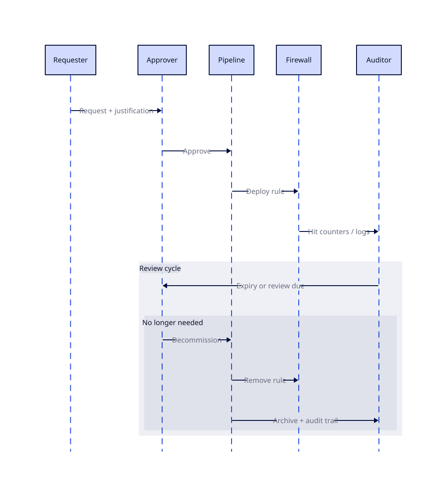
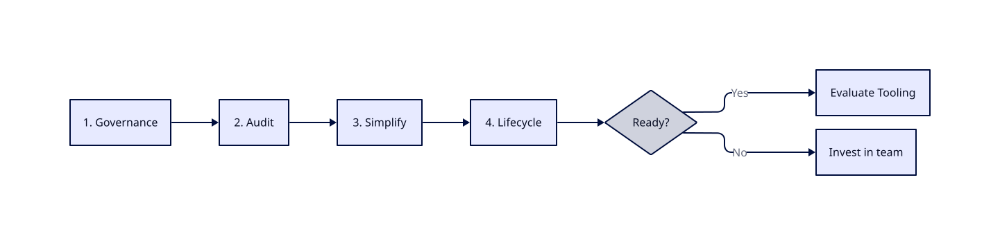
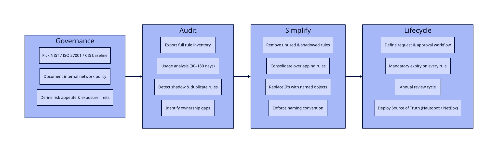
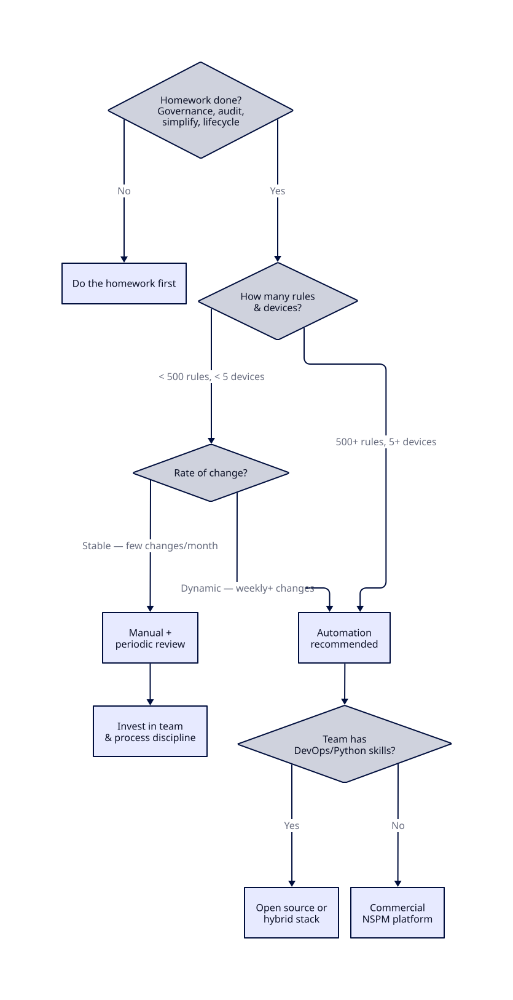
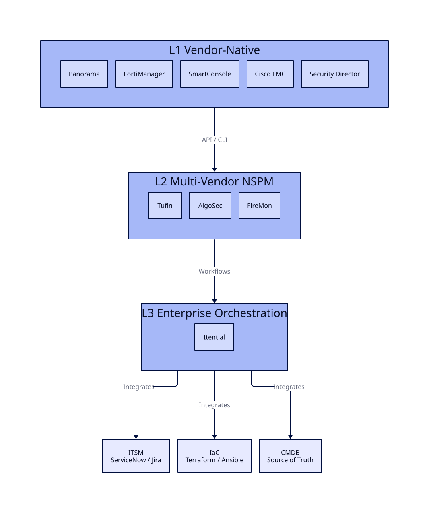
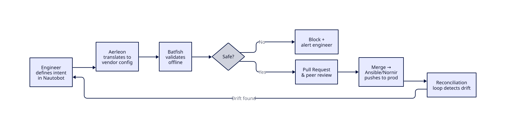

# Firewall Automation: Simplify First

_Vendor-agnostic. No hype. Practical reasoning on whether automation is right for you — and what to do before you touch any tooling._

## Goal

Understand what automation actually requires — and what to get right before you start.

## Why This Matters

Firewall management is broken in most organizations. Not because teams lack tools — because they lack clarity. Rules accumulate for years with no owner, no expiry, no documented purpose. Automation through a Network Security Policy Management (NSPM) platform doesn't fix that. It amplifies it.

This paper argues one thing: **simplification is the prerequisite to automation, not a side task.**

## The Problem With Firewall Rule Management

If someone manages your firewall rules by hand, that's legacy — regardless of how modern your hardware is.

The pressure on firewall management comes from two directions: technical standards pulling toward more granularity, and business/regulatory requirements pulling toward more accountability.

**What modern security standards demand:**

- **Zero Trust** — default-deny everywhere, not just at the perimeter
  - Broad zone-based trust is dead: "Internal" is not a security boundary
  - Microsegmentation: east-west traffic controlled, not just north-south
- **Identity-aware policy** — rules tied to user, device, and application context, not raw IPs
  - An IP tells you nothing about who or what is communicating
- **Layer 7 inspection** — application-layer visibility, not just port/protocol
  - Port 443 carries everything now; L4 rules are blind to what's inside
- **Rule lifecycle** — every rule needs an owner, a justification, and an expiry
  - A rule with no expiry is a rule no one will ever delete

**What businesses and regulators demand:**

- **Continuous compliance** — prove at any moment that config matches policy (PCI-DSS, NIS2, ISO 27001)
  - Drift detection: flag when reality diverges from desired state
- **Full audit trail** — who changed what rule, when, and why
  - Not just a CMDB entry — a traceable, tamper-evident history
- **Application mapping** — every rule tied to a business application or service
  - Enables impact analysis: "what breaks if I decommission this app?"
- **Change accountability** — no rule without a ticket, an owner, and a review cycle
  - Regulators don't accept "we inherited it" as an answer
- **Speed and agility** — dev and ops teams can't wait 3 weeks for a firewall rule
  - Cloud and CI/CD pipelines move fast; manual firewall processes are a bottleneck
  - Rule requests become a source of friction and shadow IT: teams route around the firewall process rather than through it
  - The network team gets blamed for slowing delivery — even when the real problem is the lack of a scalable process

So — does automation fix this?

## The Automation Traps

Automation becomes a trap when it's treated as a destination rather than a discipline. The tools are rarely the problem. The traps below are.

### Trap 1 — Automating Before Simplifying

Most common mistake. Teams inherit a rule base with thousands of entries — no owners, no expiry, overlapping scopes, shadow rules — and immediately look for a tool to manage it.

**Why it's a trap:** Automation requires a consistent, rational model to operate on. Legacy rule sets are neither. The tool either fails to import the config cleanly, or worse, it succeeds — and now you're deploying inconsistent rules at scale, faster than before. Garbage in, garbage out, automated.

### Trap 2 — Tool-First Thinking

Procurement drives the project. Vendor demos a platform, it looks impressive, budget gets approved. The process question — _how do we actually want to manage rules?_ — comes after.

**Why it's a trap:** The tool shapes the process instead of the process shaping the tool. Teams end up contorting their workflows to fit the product's assumptions. When the tool doesn't fit reality, workarounds accumulate — and you've added a layer of complexity on top of existing complexity.

### Trap 3 — Partial Automation

Automate rule deployment, but leave expiry, review cycles, and cleanup manual. Or automate change requests but not compliance checking. The pipeline is automated; the lifecycle is not.

**Why it's a trap:** Partial automation gives a false sense of control. Rules get deployed faster but never get cleaned up. The rule base grows faster than before. Compliance checks still fail because the back half of the lifecycle — review, retire, audit — was never included in scope.

### Trap 4 — No Rollback Plan

Automation is built, tested in staging, deployed to production. No one has defined what happens when a pushed ruleset breaks connectivity. No rollback procedure. No tested recovery path.

**Why it's a trap:** Manual changes fail one device at a time. Automated changes fail everywhere simultaneously. The blast radius is proportional to the reach of the automation. Without a tested rollback, an incident becomes a crisis — and the organization loses confidence in automation entirely, often permanently.

### Trap 5 — Ownership Disappears

Before automation: a network engineer manually pushes each change and implicitly owns it. After automation: a pipeline pushes changes. Who owns a rule now? Who's accountable when something breaks?

**Why it's a trap:** Automation diffuses accountability. Teams assume the system is managing it; the system assumes a human is watching it. Orphaned rules multiply because no one feels responsible for cleaning them up. Incidents take longer to diagnose because the chain of ownership is unclear.

### Trap 6 — Automating the Exception

Every rule base has edge cases — one-off rules for a specific server, a temporary access granted two years ago, a legacy protocol with no clean policy expression. Teams try to codify every exception into the automation model.

**Why it's a trap:** Exceptions break the declarative model automation depends on. The more exceptions encoded, the more brittle the system. The right answer is to eliminate exceptions before automating — not to build a system complex enough to accommodate all of them.

### Trap 7 — Speed as the Only Metric

Automation is sold internally on speed: rule requests go from weeks to minutes. That becomes the headline metric. Nothing else is measured.

**Why it's a trap:** Speed without accuracy is worse than slow. A rule deployed in 5 minutes that violates least-privilege, creates a compliance gap, or conflicts with an existing policy is not a win. Measuring only speed incentivizes cutting the review steps that catch those problems. The right metrics include rule quality, drift rate, and compliance posture — not just time-to-deploy.

### Trap 8 — Staging Doesn't Reflect Production

Automation is tested in a lab. The lab has 50 rules. Production has 8,000. The lab has one firewall vendor. Production has three. The lab has no stateful dependencies between rules.

**Why it's a trap:** Bugs that only appear at scale or under specific rule interactions will not surface in testing. The first real test becomes production — with real traffic, real impact. Without a staging environment that meaningfully mirrors production topology and rule complexity, automated testing provides false confidence.

### Trap 9 — Thinking Automation Replaces Vendor-Native Tools

Teams assume an NSPM platform or custom automation stack will replace Panorama, FortiManager, or SmartConsole. So they cut the vendor management licenses to fund the automation project.

**Why it's a trap:** NSPM platforms orchestrate _across_ vendors — they don't replicate what vendor-native tools do _within_ their ecosystem. Panorama's device groups, FortiManager's SD-WAN orchestration, Check Point's dynamic policy layers — these are deep, vendor-specific capabilities that no cross-vendor tool reproduces. Dropping vendor-native management to save budget means losing features you're actively using: firmware lifecycle management, HA failover control, vendor-specific threat intelligence feeds, hardware-level diagnostics. The automation layer sits _above_ Layer 1 (see Industry Landscape) — it doesn't replace it.

## Where to Start

Now that we know what to avoid, let's focus on what needs to happen FIRST — before automation is even on the table.

### 1 — Define Governance and Regulatory Baseline

Before touching any rule or tool, establish what you're actually required to do — internally and externally.

- **External regulations:** identify which frameworks apply (PCI-DSS, NIS2, ISO 27001, SOC2, local data protection laws). Each has specific requirements around access control, audit trails, and change management. You cannot design a rule lifecycle without knowing what evidence you need to produce.
- **Internal policy:** document what your organization's security policy actually says about network access. If it doesn't exist, write it — even a one-pager. Automation enforces policy; if there's no policy, automation has nothing to enforce.
- **Risk appetite:** understand what your organization considers acceptable exposure. This drives decisions like how strict segmentation needs to be and how long a temporary rule can live.

Don't invent your own governance framework from scratch. Pick an established standard — NIST, ISO 27001, CIS Controls — and adopt its firewall-relevant sections. Adapt only what's strictly necessary. These frameworks provide battle-tested structure, regulatory recognition, and a common language for auditors. Custom governance takes months of meetings, produces documents nobody reads, and drifts from reality within a quarter.

Keep the working group to 3–5 people. Every additional person slows convergence and adds opinion without proportional value.

The output of this step is a clear, written answer to: _what does a compliant, well-managed rule look like in our environment?_

### 2 — Audit the Current State

You cannot simplify what you haven't measured. Before any cleanup, get a complete picture of what exists.

- **Full rule inventory:** export every rule from every firewall, across all platforms and sites
- **Usage analysis:** identify rules with no traffic hits over the past 90–180 days — strong candidates for removal
- **Shadow and duplicate rules:** rules that are never reached because a broader rule above them already matches
- **Ownership gaps:** rules with no associated ticket, no named owner, no documented purpose
- **Age distribution:** how old is the rule base? Rules older than 3 years with no review are a liability

Most teams are surprised by the numbers. FireMon's 2026 enterprise data shows: 30% of rules completely unused, 95% of application objects and 82% of service objects with zero usage, 10% of rules redundant or shadowed, and 6% with no owner or documentation. The maturity path validated by industry analysts (IDC, Gartner) puts Visibility as Phase 1 — before Governance, before Automation, before Resilience. Getting these numbers is the first honest conversation you can have about the problem.

### 3 — Simplify and Standardize

This is the hardest step and the most important. The goal is to reduce the rule base to something a machine can reason about.

**Reduce rule count:**

- Remove unused and shadowed rules (with proper change control and testing)
- Consolidate overlapping rules into broader, cleaner entries
- Replace one-off host rules with group or tag-based rules where possible

**Introduce abstraction:**

- Stop writing rules against raw IPs — IPs change, move, get reassigned
- Use named objects, groups, and tags that map to business meaning: `APP-CRM-PROD`, `NET-DATACENTER-DMZ`, not `10.2.4.0/24`
- Define zones that reflect your actual security model, not your VLAN history

**Standardize naming and structure:**

- Consistent naming convention for all objects and rules: enforced, not suggested
- Every rule must have: owner, business justification, creation date, review/expiry date
- No exceptions — including rules that predate the policy

**Why this unblocks automation:** automation tools work on declarative, consistent models. A rule base built on named objects with clear ownership can be expressed as code. A rule base built on raw IPs and tribal knowledge cannot.

### 4 — Establish a Rule Lifecycle Process

Simplification solves the past. A lifecycle process prevents the problem from recurring.

- **Request workflow:** every rule request goes through a defined process — who can request, who approves, what justification is required
- **Mandatory expiry:** no rule is permanent by default. Every rule gets a review date at creation. Temporary rules get a hard expiry.
- **Review cycle:** all rules reviewed at least annually. No owner response = rule flagged for removal.
- **Decommission process:** when an application is retired, its rules are removed. This must be enforced — not optional.

**Underpin it with an authoritative Source of Truth.** A lifecycle process needs a system of record. Platforms like Nautobot or NetBox provide structured data models for IP address management, device inventory, and service mapping — with Git integration and API access. Nautobot's Data Validation Engine catches rule duplication and harmful overlaps before policy is ever applied. Its Golden Config app generates intended configurations, runs automated backups, and executes compliance remediation. The key: the source of truth must be the _only_ place network state is defined. Two sources of truth means none.

This step is organizational, not technical. It requires buy-in from security, network, and application teams. Without it, the rule base will drift back to its previous state within 18 months — regardless of what automation you put on top.

Only after completing these four steps does it make sense to evaluate automation tooling. At that point, you have a clean rule base, a consistent model, defined ownership, and a process to maintain it. Automation has something to work with.

Task breakdown per phase:

## Cost Analysis

Business will ask for ROI before greenlighting anything. Fair enough. But building an honest one requires answering four questions — in the right order.

### 1 — What Does It Currently Cost You?

Can't calculate ROI without a baseline. Most organizations have never measured the true cost of manual firewall management — it's distributed across teams and buried in operational overhead.

**Direct costs to measure:**

- **FTE time on rule management:** how many hours per week do engineers spend on rule requests, reviews, troubleshooting, and audits? Track this over a month — it's always higher than people estimate.
- **Incident cost from misconfigurations:** outages caused by wrong rules, forgotten rules, conflicting rules. Include downtime, war room hours, and post-mortem effort.
- **Audit and compliance cost:** preparation time for audits, remediation effort when findings come back, cost of external auditors or consultants.
- **Opportunity cost:** what are those engineers _not_ doing because they're pushing firewall rules? Projects delayed, technical debt unaddressed, security improvements deferred.

**Indirect costs to acknowledge:**

- Shadow IT and workarounds when rule request process is too slow
- Security exposure from rules that should have been removed but weren't
- Staff frustration and retention risk from repetitive manual work

Get real numbers. Even rough estimates make the argument concrete. "Our team spends approximately 30 hours per week on manual rule operations" is more powerful than any vendor ROI calculator.

### 2 — What Will the Preparation Phase Cost?

Before any automation tool enters the picture, the "Where to Start" steps must be completed: governance, audit, simplification, lifecycle process. This phase has a real cost.

From experience, the biggest cost here is not technical — it's organizational. It involves meetings, alignment, and decisions that move slowly in large organizations.

**How to keep this phase lean:**

- **KIS — Keep It Simple.** Don't invent your own governance framework. Pick an existing standard (NIST, ISO 27001, CIS Controls), adopt its firewall-relevant sections, and adapt only what's strictly necessary.
- **Small teams.** Keep decision-making groups to 3–5 people. More people at the table = slower convergence, more opinion, less action.
- **Timeboxed phases.** Set deadlines for governance definition, audit completion, and cleanup milestones. Without deadlines, this phase stretches indefinitely.

**Cost components:**

| Item | Typical range |
|---|---|
| Governance and policy definition | 2–4 weeks of focused effort (small team) |
| Rule audit and usage analysis | 1–4 weeks depending on tooling and rule count |
| Rule cleanup and simplification | 2–6 months (the long tail — requires testing and change windows) |
| Process design and documentation | 1–2 weeks |
| Training and adoption | Ongoing, low intensity |

Not cheap, but not optional. Every shortcut here resurfaces as a trap later. Good news — most of this work delivers value _before_ automation even starts. A clean rule base with ownership and lifecycle is already a massive improvement.

### 3 — What Will Automation Cost?

Once the foundation is in place, automation itself has a cost envelope.

**Tooling costs:**

- **Commercial orchestration platforms** (Tufin, AlgoSec, FireMon, etc.): license fees, typically per managed device or per rule count. Budget varies widely — from tens of thousands to hundreds of thousands annually depending on scale.
- **Open-source / in-house approach** (Ansible, Terraform, custom scripts): no license cost, but engineering time to build, maintain, and support. Not free — just paid in salary instead of licensing.
- **Vendor-native automation** (Panorama, FortiManager, FMC): included in existing platform cost, but limited to that vendor's ecosystem.

**Integration and deployment:**

- Connecting automation to ITSM (ServiceNow, Jira), CMDB, SIEM/SOAR
- Building or configuring the CI/CD pipeline for rule deployment
- Staging environment setup that mirrors production topology
- Rollback mechanism design and testing

**Operational costs:**

- Ongoing maintenance of automation pipelines and integrations
- Training: network engineers need IaC skills (Git, Ansible/Terraform basics)
- At least one person who owns the automation platform — it doesn't run itself

### 4 — What Is the Expected Return?

With the previous three answers in hand, ROI is straightforward math. But be realistic about what to claim.

**Measurable returns:**

- **FTE time recovered:** if manual operations cost X hours/week, how much does automation reduce that? Rarely 100% — 50–70% is a credible target.
- **Faster rule delivery:** from weeks to hours/days. Value depends on how much business impact the current delay causes.
- **Reduced incidents:** fewer misconfigurations = fewer outages. Use current incident data as baseline.
- **Audit effort reduction:** continuous compliance replaces manual evidence gathering. Audits go from weeks of preparation to near-zero.

**Harder to quantify but real:**

- Reduced security exposure from automated rule expiry and cleanup
- Improved team morale and retention
- Faster onboarding of new team members (process is documented and enforced, not tribal)

**What NOT to claim:**

- 100% reduction in manual effort — there will always be exceptions, escalations, and edge cases
- Immediate ROI — the preparation phase takes months before automation delivers value
- Zero incidents — automation reduces human error but introduces new failure modes

**The honest pitch to leadership:** the preparation phase alone pays for itself through reduced rule sprawl, better compliance posture, and fewer incidents. Automation accelerates and sustains those gains. The ROI is real — but it's backloaded, not instant.

## Do You Actually Need Automation?

If you've read this far, one thing should be clear: the homework before automation is significant. Governance, auditing, simplification, lifecycle processes — none of this is trivial. It takes months, cross-team alignment, and sustained effort.

This raises an uncomfortable question: **if you do the homework properly, do you still need automation?**

There is no universal answer. It depends on three factors:

**Scale.** An organization managing 200 rules across 3 firewalls has a fundamentally different problem than one managing 15,000 rules across 50 devices from 3 vendors. At smaller scale, a well-disciplined team with clean rules and a solid process may never need orchestration tooling. At larger scale, the volume of changes, the compliance burden, and the coordination overhead make manual management unsustainable regardless of how good the engineers are.

**Team capability.** If the simplification process has educated your engineers — if they now understand intent-based rules, object grouping, naming standards, and lifecycle discipline — they may be capable of maintaining quality manually. Good engineers with clear processes and a small rule base don't need a six-figure NSPM platform. That said, even excellent engineers make mistakes under pressure, during incidents, or after turnover. Automation's value here is consistency, not intelligence.

**Rate of change.** If your environment is stable — few new applications, infrequent rule changes, predictable infrastructure — manual management with periodic compliance reviews may be enough. If you're in a CI/CD-driven environment where developers request firewall changes weekly, or you're managing cloud security groups that spin up and tear down dynamically, manual processes will become the bottleneck regardless of team quality.

The honest assessment:

- **The homework alone delivers enormous value.** A clean, owned, standardized rule base with lifecycle processes is already a massive improvement over where most organizations start. Many of the security and compliance benefits attributed to automation actually come from this foundation work.
- **Automation sustains and accelerates the gains.** It prevents drift, enforces consistency at scale, reduces human error under load, and frees engineers for higher-value work. But it's an accelerator, not the engine.
- **Not automating is a valid outcome.** If the cost analysis shows that manual management with periodic compliance checks is sustainable for your scale and rate of change, then the answer is: do the homework, skip the tooling, and invest in your team instead.

Drift is still inevitable even with the best processes. Rules accumulate, exceptions creep in, ownership decays as people leave. The question is whether you address drift through periodic manual reviews or through continuous automated detection. Both work — at different scales and costs.

If the answer lands on "yes, automate" — the follow-up question is _which tier_: vendor-native (Layer 1) may already cover your needs, or you might need cross-vendor NSPM (Layer 2) on top. That decision is covered in "Choosing Your Path" later.

## Don't Go That Route

What follows are approaches that look reasonable on paper but consistently fail. Backed by industry data, post-mortems, and patterns I've seen repeatedly.

### Don't Automate Without a Source of Truth

If automation queries a database with outdated IPs, wrong device associations, or stale service tags, it will flawlessly execute the wrong configuration.

**Why this fails:** Automation trusts its data blindly. When a human pushes a rule manually, they might notice an IP looks wrong or a hostname doesn't exist anymore — and pause. An automated pipeline has no such instinct. It reads the database, generates the config, and pushes it. If the data says server X is at 10.2.4.5 but server X was decommissioned three months ago, the pipeline will happily create a rule pointing to nothing — or worse, to whatever now sits at that address.

Most organizations still rely on spreadsheets or poorly maintained CMDBs as their "source of truth." Research shows these degrade in accuracy by 5–10% per month without automated updates. After a year, 40–70% of entries may be outdated. Your automation is now making decisions based on data that no longer reflects reality.

Without an authoritative, dynamically updated Source of Truth (platforms like Nautobot, NetBox, or a properly maintained ServiceNow CMDB), automation is a loaded gun pointed at your own network.

### Don't Skip Pre-Deployment Validation

"It worked in the lab" is not a deployment strategy. Pushing configuration changes to production firewalls without mathematical safety checks is how organizations take themselves offline.

**Why this fails:** A documented case: an engineer ran an automated route table change on an AWS subnet, accidentally replacing the default route (0.0.0.0/0) with an internal route. Result: servers received inbound traffic but had no path to respond. Complete communications blackout for 30 minutes. VP of Engineering on an emergency call.

The fix exists: tools like Batfish perform offline configuration analysis — they ingest proposed changes and mathematically model the resulting network state before a single packet is affected. They catch routing loops, shadowed rules, and compliance violations _before_ deployment. Skipping this step to save time is a false economy.

### Don't Automate a Dirty Rule Base

60% of enterprise firewalls fail high-severity compliance checks upon evaluation. 95% of configured application objects show zero usage. 30% of all rules are completely unused. 10% are redundant or shadowed.

**Why this fails:** Automating on top of this means deploying — at machine speed — a configuration that is already broken. Every unused object, every shadowed rule, every orphaned entry becomes codified into your automation pipeline. Rule bloat degrades hardware performance, obscures real vulnerabilities, and creates compliance liabilities. Automation locks it all in and makes cleanup harder, not easier.

Clean first. Then automate. Not the other way around.

### Don't Treat Automation as a One-Time Project

Teams implement automation, celebrate the launch, then move on to other priorities. No one maintains the pipeline. No one updates the policy templates when the firewall firmware changes. No one reviews the automated rule lifecycle.

**Why this fails:** Only 18% of network automation projects fully succeed. Of the rest, 54% achieve partial results that don't justify the investment, and 28% stall entirely. The biggest predictor of success is sustained funding — fully funded projects hit an 80% success rate vs. 29% for underfunded ones.

Automation is an operational capability, not a project. It needs ongoing ownership, a dedicated maintainer (even part-time), and a budget that doesn't disappear after year one.

### Don't Ignore the Day-2 Operations Gap

Infrastructure-as-Code tools like Terraform dominate Day-0 provisioning — spinning up firewalls, configuring initial rule sets. Teams assume the same tool handles everything.

**Why this fails:** IaC handles 20–30% of network service delivery (the provisioning part). The remaining 70–80% — ongoing operations, business logic changes, rollback, continuous compliance validation, rule lifecycle — is structurally outside what IaC was designed for. Teams discover this gap months into production, when they realize Terraform can deploy a firewall but can't manage the daily rule request workflow, expire unused rules, or validate compliance drift.

Plan for Day-2 from the start. Either extend IaC with orchestration layers (Itential, custom workflows) or choose a platform that covers the full lifecycle.

### Don't Automate Without Rollback

If you can push a change in 5 seconds but can't undo it in 5 minutes, your automation is a liability.

**Why this fails:** Manual changes break one device at a time. Automated changes break everything simultaneously — the blast radius is proportional to the reach of the pipeline. Without a tested, automated rollback mechanism, an incident that should take minutes to resolve becomes a multi-hour crisis. And the organization loses trust in automation — often permanently.

Rollback must be designed, built, and tested _before_ the first automated change goes to production. Not after the first outage.

### Don't Let the Vendor Choose Your Architecture

A vendor demos their platform, it looks impressive, budget gets approved. The architecture is then shaped around whatever the tool assumes: their data model, their workflow, their integration points.

**Why this fails:** You end up contorting your processes to fit the product instead of the other way around. When the tool doesn't match reality — and it won't for every case — workarounds accumulate. You've added a layer of complexity on top of existing complexity. Multi-vendor environments (87% of enterprises) are especially vulnerable: a tool optimized for one vendor's ecosystem becomes a bottleneck for everything else.

Define your requirements, your workflow, and your data model first. Then evaluate tools against that — not the other way around.

### Don't Expect AI to Solve the Fundamentals

AI-driven rule analyzers can reduce audit time by 95%. Natural language interfaces let engineers describe intent instead of writing CLI syntax. These are real capabilities available today.

**Why this fails when misapplied:** AI can identify unused rules, suggest consolidations, and flag compliance gaps. It cannot define your governance model, assign rule ownership, or fix an organizational culture that treats the firewall as "someone else's problem." AI accelerates analysis and translation — it does not replace the simplification and standardization work described in earlier chapters.

Organizations that adopt AI-powered platforms before completing the foundational work end up with very fast, very sophisticated tools producing very accurate reports about a rule base that nobody is willing to change.

### Don't Vibe-Code Your NSPM

A new option has appeared: vibe-code your own NSPM with an AI coding assistant. A few months of iterations and you have something that looks decent.

**Don't.**

This is the inverse of the vendor marketing dream ("one platform does everything"). It's the same fantasy, just flipped: "one developer plus AI does everything." Both are false.

**Why vibe-coded NSPM fails:**

- **Scope is enormous.** A real NSPM needs multi-vendor config parsing, rule semantics modeling, shadow/redundancy detection, compliance reporting, change workflow engine, audit logging, API integrations, RBAC, secrets management. AI can generate any single piece. It cannot hold the whole system in coherent architecture.
- **Validation is the hard part.** Pushing a rule is easy. Batfish-equivalent mathematical validation is a research-grade problem — it took years of academic work. LLMs won't shortcut that.
- **Maintenance debt is invisible at start.** Vibe-coded systems break in unpredictable ways once vendor APIs shift, dependencies update, or edge cases surface. Original prompts are not documentation.
- **Compliance evidence doesn't exist.** Auditors want traceable controls and reviewed code. "AI wrote it" is not an acceptable answer.

**Full custom without AI is also a bad idea.** If it were that simple, there would be more than three or four real NSPM products on the market. A full solution has many components; getting them right takes years of engineering investment.

**When custom is actually justifiable:**

- You're a hosting provider, MSSP, or cloud platform whose _business_ is firewall management at scale. The tooling is the product.
- You have unusual requirements no commercial or open-source tool covers (rare — but it exists).
- You're building opinionated internal tooling _on top of_ open-source building blocks (Nautobot + Aerleon + Batfish + custom UI). This is different from vibe-coding from scratch — you're writing the glue, not the engine.

For everyone else: **don't reinvent the NSPM.** Use building blocks that already exist. Write the glue, never the engine.

## Proven Routes

Foundation work is covered in "Where to Start." This picks up from there — what actually works when you start automating.

### Do Validate Before You Deploy

Decouple configuration generation from deployment. Every proposed change runs through offline analysis before touching production.

**Why this works:** Verification before deploying with tools like Batfish (_vendor-agnostic, open-source_) ingests proposed configurations and models the resulting network state. It verifies ACL rule sets, checks flow paths, catches routing loops, shadowed rules, and compliance violations. All before a single packet is affected. In large-scale refactoring (compressing massive ACLs by removing redundant entries), offline validation accelerates timelines by weeks while eliminating outage risk.

The workflow: engineer submits a Pull Request → CI/CD pipeline pulls topology from source of truth → translates intent via policy engine → validates safety with verification tool → peer review → merge → deploy. No human touches a firewall directly.

### Do Automate Hygiene First

Don't start with end-to-end rule lifecycle automation. Start with low-risk, high-value hygiene tasks that build trust and show immediate results.

**Why this works:** Three proven starting points:

1. **Rule decommissioning** — automate removal of unused rules and expired entries. Lowest priority for busy teams, highest security value. Immediately shrinks attack surface and reclaims hardware resources.
2. **Drift detection** — read-only automation that compares desired state to actual state and flags divergence. No automated changes yet — just visibility. Builds confidence in the data model.
3. **Compliance reporting** — automated checks against your chosen framework (CIS, NIST, PCI-DSS). Replaces weeks of manual audit preparation with continuous validation.

These are low-risk because they don't push changes to production firewalls. They prove the automation pipeline works, validate the source of truth, and deliver measurable wins to show leadership.

### Do Fund It Properly

The single largest predictor of automation success is financial commitment. Fully funded projects achieve an 80% success rate. Underfunded initiatives: 29%.

**Why this works:** The 82% failure rate is heavily skewed toward organizations that tried to do it on the cheap — low-code tools on complex multi-vendor problems, or automation assigned to an already overloaded team.

Budget for: platform licensing or engineering time (pick one), training (Git, Ansible/Terraform basics), a staging environment that mirrors production, and at least a part-time maintainer for the first two years.

### Do Adopt a Hybrid "Build AND Buy" Strategy

Buy commercial orchestration for the 80% of standard multi-vendor workflows. Reserve custom development for the 20% of workflows that are genuinely proprietary and drive competitive differentiation.

**Why this works:** Commercial platforms handle multi-vendor API abstraction, SLAs, compliance frameworks, and support. Custom scripts fill gaps where your workflow is truly unique — but only those gaps. Avoids both extremes: "build everything" (300–500% cost overrun) and "buy everything" (contorting your process to fit a vendor's assumptions).

### Do Use GitOps as the Control Plane

All firewall changes go through Git. No direct CLI access to production firewalls. Every change is a Pull Request — reviewed, tested, merged, then deployed by the pipeline.

**Why this works:** Git provides an immutable audit trail (who changed what, when, why), peer review before deployment, and a natural integration point for validation tools. A continuous reconciliation loop detects and reverts any manual "out-of-band" changes made directly on a firewall, eliminating configuration drift.

This also solves the compliance evidence problem: your Git history _is_ your change documentation. Auditors get a complete, tamper-evident record without anyone assembling it manually.

## AI — Where It Actually Helps

Every NSPM vendor now has AI features. Most pitch it as the automation layer — natural language rule creation, intent-based policy generation, AI-driven change management. That's real technology, but it's not where AI delivers the most value for most organizations.

AI shines hardest in the homework phase — the part nobody wants to do manually.

**Auditing.** AI can ingest thousands of rules across multiple vendors and give you a structured analysis in hours instead of weeks. Unused rules, shadowed rules, overlapping scopes, compliance gaps — the exact inventory work described in "Where to Start" step 2. You don't need an NSPM platform for this. A well-prompted LLM with your exported rule base can do correlation and analysis that would take a team of engineers days.

**Governance and documentation.** Writing governance frameworks, naming conventions, lifecycle procedures — AI is good at drafting structured documents from requirements. It won't replace the decisions (those still need humans around a table), but it compresses the writing and formatting work from weeks to hours.

**CMDB and inventory.** Building or cleaning a CMDB extract — correlating IPs to hostnames to applications to owners — is exactly the kind of tedious, pattern-heavy work AI handles well. Feed it your data sources, let it produce a draft inventory, then have engineers validate. Faster and more accurate than doing it manually from scratch.

**Rule translation and migration.** Moving rules between vendors or platforms (Cisco ASA to Palo Alto, on-prem to cloud security groups) is translation work. AI handles syntax conversion well, and tools like Aerleon already automate this — AI extends that to edge cases and non-standard configurations.

The point: **AI's biggest impact is in the preparation, not the automation.** It compresses the painful homework that this entire paper argues you must do first. If you're looking for quick wins, start there — not with AI-powered rule deployment.

## Industry Landscape

Three categories of tools address firewall automation today. They solve different problems — mapping them to yours prevents the most expensive mistakes.

- **Global commercial solutions** — US/Israeli market leaders. Deepest features, widest vendor coverage, no data sovereignty guarantees.
- **European commercial solutions** — smaller ecosystem, EU-sovereign deployment, NIS2/DORA alignment out of the box. Choose when data residency is a hard requirement.
- **Open source solutions** — no turnkey NSPM exists, but strong building blocks (Nautobot, Batfish, Aerleon). Viable with Python/DevOps skills and moderate scale.

What follows covers what each category offers, where it fits, and what it doesn't do.

### Global Commercial Solutions

Three layers exist here. Understanding which solves what prevents buying the wrong tool.

- **Layer 1 — Vendor-native management:** single-vendor centralized control (Panorama, FortiManager, etc.)
- **Layer 2 — Multi-vendor NSPM:** cross-vendor policy orchestration (Tufin, AlgoSec, FireMon)
- **Layer 3 — Enterprise orchestration:** end-to-end workflow automation spanning tools and systems (Itential)

#### Layer 1 — Vendor-Native Management Platforms

Centralized consoles from the firewall manufacturers. Deepest integration with their own hardware, but locked to that vendor's ecosystem. 87% of enterprises run multi-vendor — so this solves part of the problem, not all of it.

**Palo Alto Networks — Panorama / Strata Cloud Manager**

Centralized management for all PA NGFWs. Strata Cloud Manager extends this to cloud-native.

- Centralized policy creation, deployment, and monitoring across all PA firewalls
- ML-powered threat detection, WildFire sandboxing, and TLS inspection
- Deep application-layer visibility (App-ID) — granular policy per application, not just per port
- Device groups and templates for scalable policy distribution
- Deeper policy granularity than most competitors, but requires more training and expertise
- Target market: enterprise with larger budgets and sophisticated requirements

**Fortinet — FortiManager**

Centralized device and policy management for the FortiGate fleet.

- Single pane of glass for policy distribution and monitoring across distributed deployments
- ASIC-accelerated hardware delivers superior raw throughput with lower latency
- Integrated with Fortinet Security Fabric (FortiAnalyzer, FortiSIEM, FortiSOAR)
- Simpler deployment model and lower cost than Panorama — suits SMB to mid-enterprise well
- SD-WAN management built in alongside firewall policy
- Limitation: FortiGate ecosystem only

**Check Point — SmartConsole (R82)**

Unified management for Check Point's security environment.

- Manages up to 500 Security Gateways / Cluster Members with concurrent policy installation
- R82 introduced dynamic policy layer configuration through direct API calls to Security Gateways — significant for DevOps integration
- Enhanced HTTPS inspection with dedicated inbound policy and certificate management views
- Full API access for automation and CI/CD pipeline integration
- Auto-updating SmartConsole keeps management tooling current without manual intervention

**Cisco — Secure Firewall Management Center (FMC)**

Centralized management for Cisco Secure Firewall (formerly Firepower).

- Policy management, event logging, threat detection, and compliance reporting in one console
- Deep integration with Cisco's broader security ecosystem (ISE, SecureX, Umbrella)
- Strongest in environments where Cisco is already the networking backbone
- Limitation: Cisco ecosystem only; less competitive in pure multi-vendor firewall environments

**Juniper — Security Director / Junos Space**

Manages SRX Series firewalls — centralized policy, VPN, and NAT.

- Policy-based automation for SRX deployments
- Integration with Juniper Apstra for intent-based networking
- Strongest in environments tightly coupling security with enterprise routing
- Limitation: Juniper/SRX ecosystem only

#### Layer 2 — Multi-Vendor NSPM Platforms

These sit _above_ vendor-native management. They don't replace Panorama or FortiManager — they orchestrate across them. If you run firewalls from multiple vendors, this is where the real value is.

**Tufin — Orchestration Suite (TOS)**

Israeli vendor, market leader in network security policy management. 4.3 on Gartner Peer Insights.

- **SecureTrack+**: unified visibility across firewalls, cloud platforms, SASE, and edge infrastructure. Dynamic topology modeling accurately maps complex topologies across AWS, Azure, GCP, VMware NSX-T, and Cisco ACI.
- **SecureChange+**: automated change management — rule requests through flexible, auditable, policy-driven workflows from request through provisioning.
- Path analysis for connectivity troubleshooting across multi-vendor environments
- Microsegmentation support: zone-to-zone policy visualization and enforcement
- Exposure assessment: identifies which assets are actually reachable (enhances vulnerability prioritization)
- Compliance mapping: maps firewall rules to compliance requirements with automated reporting
- Strongest on: topology modeling, path analysis, and change workflow automation

**AlgoSec — Horizon Platform**

Israeli vendor, 4.5 on Gartner Peer Insights (highest peer rating in category). Winner of 2026 SC Award for Best Risk/Policy Management Solution.

- **Firewall Analyzer**: optimizes rules, identifies redundant/risky configurations
- **FireFlow**: automates change management, reduces manual errors
- **Change Manager**: policy impact simulation — shows exactly what will be affected before changes are made
- AI-powered automatic identification of business applications across multi-cloud and data centers
- Application-centric approach: maps security policies to business applications, not just network segments
- Full lifecycle management: risk analysis → policy design → change simulation → validation
- Strongest on: application-centric visibility, risk assessment, and policy simulation

**FireMon — Policy Manager**

US vendor, finalist for 2026 SC Award for Best Risk/Policy Management Solution.

- Real-time visibility and continuous compliance across hybrid environments
- Supports over 15,000 devices and 25 million rules — unmatched scalability claim
- AI-powered FireMon Insights: continuously evaluates firewalls against compliance standards (PCI-DSS, HIPAA, SOX, GDPR, NIST)
- **Policy Workbench** (January 2026): guided policy design workspace with day-one recommendations and path to policy automation
- Zero Trust control plane with risk-aware policy change management
- SOC integration: surfaces policy context and pre-approved change templates for incident responders
- Strongest on: real-time compliance monitoring, scalability, and incident response integration

**Skybox Security** — _discontinued_

Shut down operations February 2025. Former customers migrating to Tufin, AlgoSec, FireMon, or emerging alternatives like FwChange and Nautobot + IP Fabric combinations. Mentioned here because legacy Skybox installations still exist in production — if you have one, migration is urgent.

#### Layer 3 — Enterprise Orchestration Platforms

Above Layer 2. Don't analyze firewall policies — they connect NSPM tools, IaC, CMDBs, and ticketing into governed end-to-end workflows. They solve the Day-2 gap.

**Itential — Automation Platform**

The most prominent enterprise-grade network orchestration platform.

- Connects Ansible, Terraform, vendor-native tools, and NSPM platforms into governed workflows spanning Day-0 provisioning through Day-2 operations
- **FlowAI** (2026): AI-driven agentic orchestration — connects AI reasoning to deterministic, policy-enforced execution
- 1,000+ integrations across cloud, network, and IT infrastructure
- Self-service publishing: Python scripts, Ansible playbooks, or OpenTofu plans exposed as consumable services with governance
- Lifecycle intelligence: every service tracked from provisioning through change, optimization, and retirement
- Case study: Southern California Edison — 15,000+ engineer hours saved, per-device upgrades from 6 hours to under 20 minutes, 80–90% reduction in manual change steps
- Target: large enterprise and critical infrastructure with complex multi-vendor, multi-domain environments

#### Choosing the Right Layer

| Scenario | What you need |
|---|---|
| Single-vendor firewall fleet | Layer 1 alone may suffice (Panorama, FortiManager, etc.) |
| Multi-vendor firewalls, need cross-vendor visibility | Layer 1 + Layer 2 (vendor-native + NSPM platform) |
| Multi-vendor + complex change workflows + compliance | Layer 1 + Layer 2, possibly Layer 3 |
| Large enterprise, multi-domain, IaC + ITSM integration | All three layers |

Most organizations running 2+ firewall vendors need at least Layer 2. The question is whether the scale and workflow complexity justify Layer 3.

### European Commercial Solutions

NSPM market is dominated by US and Israeli vendors. If data sovereignty, NIS2, or EU regulatory alignment are hard requirements, European alternatives exist — but the landscape is smaller and more fragmented.

#### Full NSPM / Orchestration Platforms

**Ruleblade** (France — EU sovereign)

A 100% EU-sovereign network security orchestration platform positioned as a direct alternative to AlgoSec and Tufin. Deployed self-hosted as a VM in your own data center — data never leaves your jurisdiction and can operate fully offline.

- Application-centric firewall management with automated implementation
- Multi-vendor policy automation: Palo Alto (PAN-OS + Panorama), Fortinet FortiGate, Check Point, Stormshield
- Blade Risk scoring for automated risk assessment
- Full lifecycle orchestration: business request → deployment → monitoring → recertification
- NIS2 and DORA aligned out of the box

Ruleblade is currently the only EU-based vendor offering full NSPM orchestration comparable to Tufin or AlgoSec.

**Opinnate** (Turkey)

A multi-vendor firewall analysis, optimization, and automation platform. Manages all firewalls centrally regardless of vendor or device count. Three editions (Lite, Standard, Enterprise) for different scales. Positioned as a lighter-weight alternative to Tufin/AlgoSec with strong multi-vendor support. Check Point technology partnership for joint firewall rule automation and optimization. Turkey is a transcontinental country — not EU, but geographically European. Consider data residency implications.

**FwChange** (Europe)

Emerged after Skybox Security shut down operations in February 2025, leaving customers stranded. Starting at €299/firewall/month. Transparent pricing, simpler scope than full NSPM. Worth evaluating for organizations that need firewall change management without the complexity of a full orchestration suite.

#### European Firewall Vendors With Built-In Management

No cross-vendor NSPM, but strong centralized management for their own ecosystems.

**Stormshield** (France — ANSSI certified)

SMC automates rule administration, VPN topologies, and filtering policies across the SNS fleet from a single point. REST API for third-party integration. "Cybersecurity Made in Europe" label, high-level ANSSI certifications. Used in 2026 for automated policy deployment across multi-site OT/IT networks. Limitation: Stormshield devices only.

**Rohde & Schwarz / LANCOM Systems** (Germany)

LANCOM Unified Firewalls managed through LANCOM Management Cloud (LMC) for highly automated, centralized configuration. Full SD-WAN, SD-LAN, SD-WLAN portfolio with integrated UTM. Development, assembly, and hosting guaranteed in Germany — management data never crosses German borders. Cloud-ready pairing via PIN or activation code. Limitation: LANCOM ecosystem only.

**genua GmbH** (Germany — Bundesdruckerei Group)

The genugate high-resistance firewall holds BSI certification for Common Criteria EAL 4+ and AVA_VAN.5 — the first and currently only firewall designated by BSI as "high-resistant." As of March 2026, genugate is the first virtualized firewall to receive this certification, with performance improvements up to 10x over the previous generation. Supports automated policy deployment and patch management via Ansible playbooks — with BSI-certified patch management, a unique distinction. Tailored for public sector, defense, and security-critical industries.

**Clavister** (Sweden)

Swedish vendor, founded 1997. NetShield is carrier-grade — up to 800 Gbps firewall throughput, 50 Gbps VPN. Clavister InControl manages thousands of NGFWs with Global Policies and Zero-Touch Deployment. Nokia partnership for Managed Firewall Services. Targets telco, defense, and critical infrastructure — not general enterprise NSPM.

#### The Gap

No EU vendor matches Tufin or AlgoSec depth for cross-vendor orchestration at enterprise scale yet. Ruleblade is closest but younger with a smaller install base. Practical choice today:

- **Commercial US/Israeli NSPM** (Tufin, AlgoSec, FireMon) for cross-vendor orchestration
- **European firewall vendor** (Stormshield, genua, LANCOM) for enforcement hardware with sovereign guarantees
- **Ruleblade** if full-stack EU sovereignty is a hard requirement

Market opportunity. NIS2 enforcement is live, DORA is tightening for financial services. Expect this landscape to evolve fast.

### Open Source Solutions

No single open-source tool covers full NSPM lifecycle. Each solves one piece. The value is in combining them — and knowing which combinations actually work.

#### The Building Blocks

##### Source of Truth

**Nautobot** (Network to Code)
Network Source of Truth platform. Structured data models for IPAM, device inventory, and service mapping. The **Nautobot Firewall Models** plugin adds vendor-agnostic Layer 4 firewall policy and ACL modeling. Data Validation Engine checks for rule duplication and overlaps before policy is applied. Golden Config app generates intended configurations, runs backups, and enforces compliance. Git integration, GraphQL and REST APIs for automation consumers.

- GitHub: nautobot/nautobot
- Plugin: nautobot/nautobot-app-firewall-models

**NetBox** (DigitalOcean / NS1)
The original open-source network source of truth. IPAM, DCIM, circuit tracking, and device inventory. Mature, large community, extensive plugin ecosystem. Does not have native firewall policy modeling like Nautobot's Firewall Models plugin — requires custom plugins or external tools for ACL management.

- GitHub: netbox-community/netbox

##### Policy Translation

**Aerleon** (fork of Google's Capirca)
Accepts vendor-agnostic YAML policy and network definitions, outputs vendor-specific CLI/API configurations for 30+ platforms (Cisco, Palo Alto, Fortinet, Juniper, iptables, etc.). Typed Python API for ACL generation and aclcheck queries. Detects rule shadowing before configuration is passed downstream. Replaced Capirca's custom DSL with structured YAML — integrates cleanly with CI/CD pipelines.

- GitHub: aerleon/aerleon
- PyPI: aerleon

**Capirca** (Google — legacy)
The original policy-as-code tool, created in 2007. Still functional but uses a custom Domain Specific Language that's difficult to integrate with modern automation. Aerleon supersedes it for new deployments. Nautobot Firewall Models is transitioning from Capirca to Aerleon integration.

##### Pre-Deployment Validation

**Batfish** (Intentionet)
Offline network configuration analysis. Ingests device configs and routing information, mathematically models the control plane without touching production. Verifies ACL rules, queries flow paths, catches routing loops, shadowed rules, and compliance violations. Vendor-agnostic. The gold standard for "will this change break anything?" before deployment.

- GitHub: batfish/batfish
- Website: batfish.org

##### Execution Engines

**Ansible** (Red Hat)
Declarative, YAML-based automation. Massive community, specific modules for Nautobot inventory APIs and all major firewall vendors. Well-known, easy to learn for network engineers. Limitation: sequential execution and SSH-per-task overhead can bottleneck at scale when pushing thousands of complex rules.

**Nornir**
Pure Python automation framework. Bypasses YAML playbooks in favor of Python scripts with multithreading and concurrent execution. Significantly faster than Ansible for large-scale deployments. No external daemons — direct code execution. Requires Python proficiency; steeper learning curve than Ansible.

- GitHub: nornir-automation/nornir

**Terraform / OpenTofu** (HashiCorp / Linux Foundation)
Declarative IaC for infrastructure provisioning. Strong for Day-0 (spinning up firewalls, initial rule sets, cloud security groups). Weak for Day-2 (ongoing rule lifecycle, compliance, rollback). Over 70% market share in cloud provisioning. OpenTofu is the open-source fork after HashiCorp's license change.

##### Network Libraries

**NAPALM** (Network Automation and Programmability Abstraction Layer with Multivendor support)
Unified Python API for interacting with network devices across vendors. Get/set configuration, retrieve operational data. Vendor abstraction for Ansible and Nornir.

- GitHub: napalm-automation/napalm

**Netmiko**
SSH-based Python library for sending commands to network devices. Supports 50+ device types. Lower-level than NAPALM — direct CLI interaction. Foundation for many custom automation scripts.

- GitHub: ktbyers/netmiko

##### Audit and Analysis

**Firewall Orchestrator (fworch)** (Cactus eSecurity — Germany)
The closest thing to an open-source NSPM. Imports firewall configurations from multiple vendors, provides reporting, compliance checks, and change tracking. License-free, charge-free for all basic functions. Smaller community than Nautobot/Batfish but fills a real gap.

- GitHub: CactuseSecurity/firewall-orchestrator
- Website: fwo.cactus.de

**360-FAAR** (Firewall Analysis Audit and Repair)
Toolkit for firewall analysis, policy rebuild, and configuration changes in brownfield environments. Designed for complex enterprise change planning and detailed analysis.

- GitHub: Seabreg/360AnalyticsLtd

#### Recommended Combinations

No single tool covers everything. Here are proven stacks for different levels of ambition.

##### Combo 1 — "Audit Only" (no automated changes)

For organizations that want visibility and compliance checking without pushing changes.

| Function | Tool |
|---|---|
| Source of Truth | Nautobot + Firewall Models plugin |
| Audit & Analysis | Batfish (offline rule validation) |
| Compliance Reporting | Firewall Orchestrator (multi-vendor import, compliance dashboards) |
| Change Detection | Nautobot Golden Config (backup + drift detection) |

**What this gives you:** full rule inventory, unused rule detection, shadow rule analysis, compliance reporting, and drift alerting — all without touching production. Low risk, high value. Good starting point.

##### Combo 2 — "Policy-as-Code" (validated automated deployment)

For organizations ready to automate rule deployment with safety guardrails.

| Function | Tool |
|---|---|
| Source of Truth | Nautobot + Firewall Models plugin |
| Policy Translation | Aerleon (YAML → vendor-specific syntax) |
| Pre-Deployment Validation | Batfish (mathematical safety check) |
| Execution | Ansible or Nornir (push to devices) |
| Version Control | Git (GitOps workflow) |

**The workflow:**

1. Engineer defines intent in Nautobot (or YAML policy files)
2. Aerleon translates intent to vendor-specific configuration
3. CI/CD pipeline feeds proposed config to Batfish for validation
4. Batfish confirms: no routing loops, no shadowed rules, no compliance violations
5. Peer review via Pull Request
6. On merge, Ansible/Nornir pushes to production firewalls
7. Reconciliation loop detects and reverts out-of-band manual changes

**Choose Ansible if:** team is new to automation, needs YAML simplicity, scale is moderate.
**Choose Nornir if:** team has Python skills, needs performance at scale, wants full programmatic control.

##### Combo 3 — "Full Lifecycle" (enterprise-grade open-source stack)

Maximum coverage with open-source tools. Closest to what commercial NSPM platforms provide.

| Function | Tool |
|---|---|
| Source of Truth | Nautobot + Firewall Models + Golden Config |
| IPAM | Nautobot (or NetBox) |
| Policy Translation | Aerleon |
| Pre-Deployment Validation | Batfish |
| Execution | Nornir (performance at scale) |
| Orchestration | AWX / Ansible Automation Platform (workflow governance, scheduling, RBAC) |
| Audit & Compliance | Firewall Orchestrator |
| Version Control | Git + CI/CD (GitHub Actions, GitLab CI) |
| ITSM Integration | API connections to ServiceNow / Jira for ticket-driven workflows |

**What this gives you:** intent-based policy definition, automated translation, mathematical validation, governed deployment, drift detection, compliance reporting, and full audit trail.

**The honest trade-off:** this stack works, but requires significant engineering effort to integrate and maintain. This combo makes sense if you have strong Python/DevOps skills in-house and your workflows are genuinely unique enough to justify it.

##### Combo 4 — "Hybrid" (open-source foundation + commercial orchestration)

The pragmatic middle ground. Use open-source where it's strongest (source of truth, validation), commercial where it's strongest (multi-vendor orchestration, support).

| Function | Tool |
|---|---|
| Source of Truth | Nautobot or NetBox |
| Pre-Deployment Validation | Batfish |
| Orchestration + NSPM | Tufin, AlgoSec, or FireMon (commercial) |
| Version Control | Git |

**Why this works:** Nautobot is arguably better as a source of truth than what most commercial NSPM platforms offer natively. Batfish's offline validation is unmatched. But the commercial NSPM handles the hard part: multi-vendor policy analysis, change workflows, and compliance reporting with vendor support and SLAs. Best of both worlds.

#### Emerging: Invariant

Worth watching. Invariant combines Batfish's digital twin with Aerleon's policy translation into a SaaS platform. Upload network snapshots, model changes, test impact — without building the integration yourself. Co-founded by Aerleon contributors. Still early stage but addresses the exact integration burden that makes Combo 2 and 3 expensive to build in-house.

#### Open Source Limitations — Be Honest

- **No enterprise-scale multi-vendor policy analysis** comparable to Tufin/AlgoSec/FireMon. Firewall Orchestrator comes closest but lacks the depth.
- **No turnkey change workflow.** You build it yourself from Git + CI/CD + Ansible/Nornir. That's engineering time, not license cost.
- **Support = community.** When something breaks at 2 AM, there's no SLA. You're reading GitHub issues and Stack Overflow.
- **Integration is your problem.** Connecting Nautobot → Aerleon → Batfish → Nornir → Git requires custom glue code that you must maintain.

Viable for teams with strong engineering skills and moderate scale. For larger environments or teams without deep Python/DevOps skills, total cost of ownership often exceeds commercial platforms — even though the license is free.

## Choosing Your Path

You've seen the tool categories. Three decisions remain before committing: which tier, which build-type, and what to avoid.

### Do You Need Layer 2 on Top of Layer 1?

Most moderate-to-large enterprises already run Layer 1 vendor-native tools — Panorama, FortiManager, SmartConsole, Cisco FMC. Before evaluating a Layer 2 NSPM platform, a fair question: **are you using Layer 1 to its full potential?**

Vendor-native tools already offer templating, device groups, policy abstraction, workflow hooks, change logs, and full API access. Chances are: you're not using most of it.

**Valid reasons to move up to Layer 2:**

- **Too many vendors.** Maintaining rich feature sets in three different management planes costs more than a Layer 2 overlay.
- **Feature gaps Layer 1 can't close.** Cross-vendor path analysis, application-centric visibility, unified compliance reporting, topology modeling across AWS/Azure/NSX.
- **Governed change workflows** spanning more than one ecosystem — ticket-driven rule requests with multi-vendor routing.

**Invalid reasons:**

- _"No skills in the team."_ Layer 2 is one layer higher in abstraction than Layer 1. If your team can't leverage Panorama, a six-figure NSPM won't magically fix that. You're building on broken foundations.
- _"No time to learn Layer 1."_ You'll spend that time anyway — as Layer 2 config and pre-automation homework. Skipping the foundation defers cost, doesn't eliminate it.

**Quick exercise before buying:** list the features you actually need. Compare to features you already own. Most teams discover they need 60% of what Layer 1 already provides — and never configured it.

#### Side Quest — Multi-Vendor vs Single-Vendor

Before any Layer 2 discussion, question the premise. **Do you really need multiple firewall vendors?**

The old "defense in depth via vendor diversity" argument has eroded. Modern NGFWs converge on similar feature sets and threat feeds — vendor differentiation is narrower than it used to be.

**Arguments for multi-vendor:**

- Different release cadences — zero-day response time can vary between vendors. Occasionally useful.
- Different management planes reduce the chance of the same human error propagating everywhere. Erodes with automation.
- Vendor lock-in hedge — if licensing, acquisition, or a major bug forces you to ditch a vendor, you already have alternatives in production.

**Arguments for single-vendor:**

- Every extra vendor multiplies operational cost: skills, lab environments, firmware tracking, licensing, dual policy sets.
- Integration surface shrinks: fewer APIs, fewer edge cases, less glue code.
- Layer 1 features get far deeper usage when the team only has one ecosystem to master.
- Erodes slightly with Layer 3 orchestration, but never fully disappears.

If you're seriously contemplating Layer 2, first ask whether trimming vendor count removes the problem entirely. For many mid-sized organizations, it does.

### Open Source vs Commercial

Open source needs custom glue. Research and post-mortems in this space consistently land on commercial as the safer default. As a tech nerd, I refuse to take that verdict without picking apart the arguments. Let's do it honestly.

#### Argument — "Open source means you maintain the tool itself"

Partially true — with caveats:

- **Managed services exist for open source too.** Red Hat Ansible Automation Platform, Network to Code's managed Nautobot, Intentionet's managed Batfish. You pay for hosting and support the same way you pay commercial licenses.
- **Containers flatten the maintenance curve.** Running Nautobot, Batfish, Ansible in PaaS (ECS, GKE, OpenShift) removes OS maintenance entirely. Application upgrades remain your job — but they're documented.
- **Commercial is not maintenance-free either.** Unless you go full SaaS (and most NSPM vendors don't offer it), you still patch, upgrade, schedule downtime. The difference is the safety net — support escalation. Real value, but not total.

#### Argument — "Open source needs skills you don't have"

Less true every year:

- Python is becoming a default skill in network security engineering. Automation, parsing, API integration — not a specialty anymore.
- AI-assisted coding raises the floor further. A mid-level engineer with an LLM writes glue code that required a senior Python developer three years ago.
- **Caveat:** this does _not_ mean vibe-code your NSPM. See the next chapter.

And commercial tool skills are scarcer than open source skills. There are orders of magnitude more Ansible engineers than AlgoSec engineers. The hiring pool is deeper and broader — a Python/Ansible hire is immediately useful across your whole infrastructure. An NSPM-platform-X specialist is useful in exactly one place.

#### Argument — "No contract, no support"

Partially true — and fixable:

- Red Hat (Ansible), Network to Code (Nautobot), Intentionet (Batfish) offer paid support contracts. That _is_ a contract.
- Pure community support is genuinely risky at scale and during incidents. GitHub issues and Stack Overflow at 2 AM are not an SLA.
- Commercial support is real but quality varies hugely by vendor. Read current reviews before assuming it's automatically better than paid community support.

#### Argument — "Open source has higher initial setup cost"

Gray area:

- Integrating Nautobot + Aerleon + Batfish + Ansible + Git takes months of glue work.
- Commercial NSPM also takes months of configuration and customization to fit your business. You fight the tool's opinionated model; it rarely matches your reality out of the box.
- The honest comparison is _lifetime_ cost, not initial.

#### A Point Often Missed

Open source feature sets are often **broader** than commercial NSPM. Ansible doesn't just push firewall rules — it automates servers, databases, cloud resources, CI/CD pipelines. Investing in Ansible for firewalls also covers Layer 3 orchestration, cross-domain workflows, and IaC you're probably already doing. Commercial NSPM stays in its lane.

#### Honest Verdict

**Open source is viable when:**

- Python/DevOps skills exist in-house.
- Scale is moderate — not 15,000+ devices across 10 vendors.
- You want tool investments that pay off beyond firewalls.
- You'll buy paid support for critical components (Ansible Tower, managed Nautobot).

**Commercial is viable when:**

- Multi-vendor orchestration at large scale is the core problem.
- Audit/compliance reporting is a hard requirement with zero tolerance for DIY.
- You need a vendor throat to choke when things break.

The trap is assuming one is strictly better. Most mature environments end up hybrid — see Combo 4 in the Industry Landscape chapter.

## Conclusion

Automation has enormous potential. And there's always a but.

The but is this: to succeed with automation, you need to go through painful steps first. Governance, auditing, simplification, lifecycle processes, source of truth. None of it is glamorous. All of it is necessary.

Here's the twist — once you go through those steps, you may realize automation isn't what you needed in the first place. What you needed was the discipline to confront your technical debt. The rule sprawl nobody dared touch. The ownership gaps everyone worked around. The tribal knowledge that kept things running but couldn't scale.

Cleaning that up is the real win. It improves security, simplifies compliance, reduces incidents, and makes your engineers' lives better — with or without a single automation tool.

Automation sustains and accelerates those gains. At scale, it becomes necessary. But it is never a substitute for the foundation work. Organizations that skip the homework and jump to tooling will automate their own dysfunction — faster and at greater scale.

**Don't buy the dream that a vendor, a managed service provider, or a platform will hand you the solution.** No tool fixes a messy rule base. No MSSP compensates for missing governance. No AI replaces the decision to own your technical debt. These are organizational problems that require organizational discipline — and then, if the scale justifies it, the right tooling to sustain it.

Simplify first. Then decide if you need to automate.

## About the Author

Network Security Architect with 15 years across networking, security, and programming. Geek by nature, blunt by default — this paper reflects both. Writing it is my contribution to a profession that needs more honest conversations about what automation actually solves — and what it doesn't.

Find me on LinkedIn: [adrien-nelis](https://www.linkedin.com/in/adrien-nelis/)

## Sources

### European Vendors

- Ruleblade Guard — https://ruleblade.io/en/network-security-orchestration
- Ruleblade Firewall Risk — https://ruleblade.io/en/firewall-risk
- genua BSI certification March 2026 — https://www.genua.eu/news-article/first-visualized-firewall-with-bsi-certification-for-common-criteria-eal-4-and-ava-van5
- genua genugate automated management — https://www.genua.eu/press-article/firewall-with-bsi-certified-patch-management-cc-eal4-2
- genua BSI-certified patch management — https://www.bundesdruckerei.de/en/newsroom/press-releases/firewall-bsi-certified-patch-management
- Stormshield SMC — https://www.stormshield.com/products-services/products/network-security/administration-tools-sns-firewalls/smc/
- Stormshield industrial environments April 2026 — https://kappadata.fr/en/2026/04/how-stormshield-secures-industrial-environments-at-scale/
- Clavister — https://www.clavister.com/
- Clavister CyberHive Europe — https://thecyberhive.eu/vendors/clavister
- LANCOM Unified Firewalls — https://www.lancom-systems.com/products/security/desktop-unified-firewalls
- Opinnate — https://opinnate.com/
- Opinnate / Check Point partnership — https://www.checkpoint.com/downloads/partners/sb-check-point-opinnate.pdf
- FwChange post-Skybox — https://fwchange.com/vs-skybox

### Vendor-Native Management Platforms

- Palo Alto Panorama vs FortiManager comparison — https://www.peerspot.com/products/comparisons/fortinet-fortimanager_vs_palo-alto-networks-panorama
- Fortinet vs Palo Alto NGFWs — https://www.esecurityplanet.com/cybersecurity/fortinet-vs-palo-alto-networks/
- Check Point R82 What's New — https://sc1.checkpoint.com/documents/R82/WebAdminGuides/EN/CP_R82_RN/Content/Topics-RN/Whats-New.htm
- Top Enterprise Firewalls 2026 (Check Point) — https://www.checkpoint.com/cyber-hub/tools-vendors/top-enterprise-firewalls-solutions-in-2026/

### Multi-Vendor NSPM Platforms

- Tufin Orchestration Suite — https://www.tufin.com/tufin-orchestration-suite
- Tufin Orchestration Suite Gartner reviews — https://www.gartner.com/reviews/product/tufin-orchestration-suite
- AlgoSec Horizon Platform — https://www.algosec.com/products
- AlgoSec 2026 SC Award winner — https://www.scworld.com/news/2026-sc-awards-winner-algosec-best-riskpolicy-management-solution
- AlgoSec 2026 State of Network Security Report — https://www.algosec.com/press-release/algosec2026-state-of-network-security-report-reveals-rising-demand-for-consolidation-and-control
- FireMon Policy Manager — https://www.firemon.com/products/policy-manager/
- FireMon IDC 2026 NSPM insights — https://www.firemon.com/blog/idc-2026-nspm-adaptive-security/
- FireMon 60% compliance failure report — https://www.firemon.com/press-room/press-releases/insights-firewall-failure-report/
- FireMon 2026 SC Award finalist — https://www.morningstar.com/news/business-wire/20260304200358/firemon-named-finalist-in-2026-sc-awards-for-best-riskpolicy-management-solution
- Skybox shutdown / migration — https://www.firemon.com/blog/migrating-to-a-better-skybox-security-alternative/
- Skybox alternative with Nautobot + IP Fabric — https://networktocode.com/blog/2025-02-27-skybox-alternative-automating-firewall-management-with-nautobot-ip-fabric/

### Enterprise Orchestration

- Itential Automation Platform — https://www.itential.com/
- Itential Network Automation Tools Landscape 2026 — https://www.itential.com/research/network-automation-tools-landscape/
- Itential AI Reasoning for Network Automation — https://www.itential.com/learn/ai-reasoning-network-automation/
- Itential / Southern California Edison case study — https://www.itential.com/resource/customer-stories/how-southern-california-edison-is-automating-the-grid-for-an-ai-driven-future/

### Open Source Tools

- Nautobot documentation — https://docs.nautobot.com/projects/core/en/stable/
- Nautobot Firewall Models introduction — https://networktocode.com/blog/nautobot-firewall-models/
- Nautobot Firewall Models GitHub — https://github.com/nautobot/nautobot-app-firewall-models
- Nautobot Firewall Models Capirca → Aerleon migration — https://github.com/nautobot/nautobot-app-firewall-models/issues/236
- Aerleon introduction — https://medium.com/@ankenyr/introducing-aerleon-3cbcef0412f3
- Aerleon PyPI — https://pypi.org/project/aerleon/
- Automating Firewall ACLs with Aerleon — https://www.packetcoders.io/automating-firewall-acls-with-aerleon/
- Batfish — https://batfish.org/
- Batfish ACL auditor (Network to Code) — https://networktocode.com/blog/how-to-build-an-acl-auditor/
- Firewall Orchestrator (Cactus eSecurity) — https://github.com/CactuseSecurity/firewall-orchestrator
- Firewall Orchestrator website — https://fwo.cactus.de/en/
- 360-FAAR GitHub — https://github.com/Seabreg/360AnalyticsLtd
- Invariant (Batfish + Aerleon SaaS) — https://www.invariant.tech/
- Invariant Packet Pushers coverage — https://packetpushers.net/blog/startup-radar-invariant-combines-batfish-aerleon-to-model-and-test-network-changes/
- Nornir Python network automation — https://oneuptime.com/blog/post/2026-03-20-nornir-python-network-automation/view
- Ansible vs Nornir comparison — https://www.packetcoders.io/ansible-vs-nornir/
- Network automation tooling landscape — https://www.packetcoders.io/network-automation-101-tooling-landscape/
- Open source firewall audit tools comparison — https://aimultiple.com/open-source-firewall-audit-tools
- Open source networking projects list — https://packetpushers.net/blog/open-source-networking-projects/

### AI & Rule Analysis

- AI transforming modern firewalls (StateTech) — https://statetechmagazine.com/article/2026/03/how-ai-transforming-modern-firewall-state-and-local-government
- PwC AI-driven firewall governance rule assessment — https://www.pwc.com/us/en/tech-effect/innovation/ai-driven-firewall-governance-rule-assessment.html
- AI-powered automation for firewall policies (FireMon/IDC) — https://www.firemon.com/press-room/press-releases/idc-infobrief-release/
- CAIP: detecting router misconfigurations with LLMs — https://arxiv.org/html/2411.14283v1

### Failures, Misconfigurations & Case Studies

- Misconfigurations: the low-hanging fruit attackers love (Canary Trap) — https://canarytrap.com/blog/misconfigurations/
- Firewall misconfiguration case study (FoxTech) — https://foxtechcyber.com/case-studies/firewall-misconfiguration/
- Common cloud misconfigurations (SentinelOne) — https://www.sentinelone.com/cybersecurity-101/cloud-security/cloud-misconfigurations/
- Automation loop outage post-mortem (r/devops) — https://www.reddit.com/r/devops/comments/vugw6x/what_is_the_biggest_mistake_youve_ever_made/

### Economics & ROI

- ROI of automation: beyond cost savings (Alqaim) — https://www.alqaimtechnology.com/insights/the-roi-of-automation-beyond-cost-savings
- Total economic impact of IBM Resilient (Terapixels) — https://terapixels.net/the-total-economic-impact-of-ibm-resilient/
- How to calculate cloud security ROI (Check Point) — https://www.checkpoint.com/cyber-hub/cloud-security/how-to-calculate-cloud-security-roi/
- Tines business breakdown — time saved metric (Contrary Research) — https://research.contrary.com/company/tines
- Managed IT services cost 2025 pricing guide — https://thenetworkinstallers.com/blog/managed-it-services-cost/
- Managed security services cost 2026 (Meriplex) — https://meriplex.com/managed-security-services-cost-2026/

### Success Stories

- Southern California Edison / Itential — https://www.itential.com/resource/customer-stories/how-southern-california-edison-is-automating-the-grid-for-an-ai-driven-future/
- Bank Avera / Cato Networks — https://www.catonetworks.com/customers/
- RV Connex / Swimlane — https://swimlane.com/resources/case-studies/rv-connex/
- Cisco Secure Firewall healthcare migration — https://www.enterprisestorageforum.com/software/firewall-case-studies/
- Fortinet customer case studies — https://www.fortinet.com/customers
- Palo Alto Cortex XSIAM customer stories — https://www.paloaltonetworks.com/cortex/customer-stories
- Global retail brand / Zscaler — https://www.zscaler.com/customers/global-retailer-modernizes-security

### Best Practices & Hygiene

- 3 ways to get started with firewall automation (Tufin) — https://www.tufin.com/blog/3-ways-get-started-firewall-automation
- 20 firewall management best practices (AlgoSec) — https://www.algosec.com/blog/firewall-management-best-practices
- Firewall best practices and pitfalls (Palo Alto) — https://www.paloaltonetworks.com/cyberpedia/firewall-best-practices
- Firewall rule best practices (r/sysadmin) — https://www.reddit.com/r/sysadmin/comments/qgc0y4/some_best_practices_when_configuring_firewall/
- Improve firewall rule review efficiency (Opinnate) — https://opinnate.com/firewall-rule-review-automation-need/

### CMDB & Source of Truth

- What is a CMDB in ITSM (ManageEngine) — https://www.manageengine.com/products/service-desk/itsm/what-is-cmdb.html
- CMDB data foundations (ServiceNow) — https://www.servicenow.com/docs/r/washingtondc/servicenow-platform/configuration-management-database-cmdb/cmdb-data-foundations-dashboard.html
- AWX for Ansible: managing network automation workflows — https://netodata.io/awx-for-ansible-managing-and-scaling-network-automation-workflows/
- Batfish evolution (UCLA) — http://web.cs.ucla.edu/~todd/research/sigcomm23b.pdf
- Network testing and validation frameworks — https://www.networkershome.com/fundamentals/network-automation/network-testing-validation-frameworks/

### Industry Research & Market Data

- Gartner Peer Insights NSPM reviews — https://www.gartner.com/reviews/market/network-automation-platforms
- NSPM market data (SourceForge Europe) — https://sourceforge.net/software/network-security-policy-management-nspm/europe/
- NIS2 Directive (EU) — https://digital-strategy.ec.europa.eu/en/policies/nis2-directive
- NIS2 2026 enforcement (Gateway Digital) — https://www.thegatewaydigital.com/resources/nis2-directive-in-2026/
- Top 5 NGFW solutions 2026 (Nomios) — https://www.nomios.com/news-blog/top-5-solutions-ngfw-2026/
- Open source firewall solutions 2026 (Regulus) — https://goregulus.com/cra-basics/firewall-open-source/
- Open source alternatives to Tufin (Reddit) — https://www.reddit.com/r/networking/comments/1izacc7/open_source_alternatives_to_tufin/
- Network automation architecture example (Network to Code) — https://networktocode.com/blog/network-automation-architecture-part-03/
