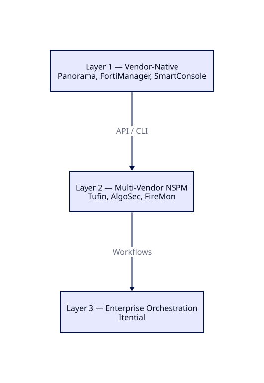
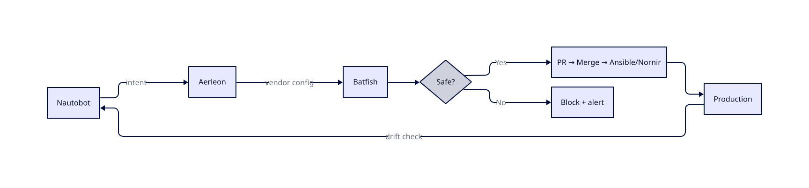

<!-- _class: lead -->
<!-- _header: '' -->

# Firewall Automation
## Simplify First

Vendor-agnostic. No hype.
Practical reasoning on whether automation is right for you.

**Adrien Nelis** — Network Security Architect

---

## The Thesis

Automation is not a destination.

> **Simplification is the prerequisite to automation,
> not a side task.**

Skip the homework and you automate your own dysfunction — faster and at greater scale.

---

## Why This Matters

Firewall management is broken in most organizations.

Not because teams lack tools — because they lack clarity.

- Rules accumulate for years
- No owners, no expiry, no documented purpose
- Automation through an NSPM platform doesn't fix that
- **It amplifies it**

---

## Modern Pressure — Two Directions

**Technical standards → more granularity**
- Zero Trust, microsegmentation
- Identity-aware policy
- Layer 7 inspection
- Rule lifecycle with expiry

**Business/regulators → more accountability**
- Continuous compliance (PCI-DSS, NIS2, ISO 27001)
- Full audit trail
- Application mapping
- Speed & agility for dev teams

---

## The Numbers That Should Scare You

FireMon 2026 enterprise data:

| Metric | % |
|--------|---|
| Rules completely unused | 30% |
| Application objects with zero usage | 95% |
| Service objects with zero usage | 82% |
| Rules shadowed or redundant | 10% |
| Rules with no owner | 6% |

This is what gets automated when you skip the homework.

---

## The 9 Automation Traps

1. Automating before simplifying
2. Tool-first thinking
3. Partial automation
4. No rollback plan
5. Ownership disappears
6. Automating the exception
7. Speed as the only metric
8. Staging doesn't reflect production
9. Thinking automation replaces vendor-native tools

---

## Where to Start — 4 Phases

Only after these four phases does automation make sense.

---

## Phase 1 — Governance

- Pick **NIST / ISO 27001 / CIS** baseline — don't invent your own
- Document internal network policy
- Define risk appetite and exposure limits

**Working group: 3–5 people max.**

Custom governance drifts from reality within a quarter.

---

## Phase 2 — Audit

- Full rule inventory across all firewalls
- Usage analysis (90–180 days)
- Detect shadow & duplicate rules
- Identify ownership gaps

The numbers always shock the team.

That's the first honest conversation you can have.

---

## Phase 3 — Simplify

- Remove unused & shadowed rules
- Consolidate overlapping rules
- Replace IPs with named objects: `APP-CRM-PROD`, not `10.2.4.0/24`
- Enforce naming convention — no exceptions

**Goal:** a rule base a machine can reason about.

---

## Phase 4 — Lifecycle

- Defined request workflow
- Mandatory expiry on every rule
- Annual review cycle
- Authoritative Source of Truth (Nautobot / NetBox)

**Organizational, not technical.**

Without it, the rule base drifts back within 18 months.

---

## Rule Lifecycle Process

---

## Cost Reality — Preparation Phase

| Task | Typical range |
|------|---------------|
| Governance & policy | 2–4 weeks |
| Rule audit | 1–4 weeks |
| Cleanup & simplification | **2–6 months (long tail)** |
| Process design | 1–2 weeks |
| Training & adoption | Ongoing |

**Not cheap. Not optional.**
Every shortcut resurfaces later.

---

## Do You Actually Need Automation?

Three factors:

- **Scale** — 200 rules vs 15,000 rules
- **Team capability** — can discipline hold manually?
- **Rate of change** — weekly requests or stable?

**The homework alone delivers enormous value.**
Automation sustains and accelerates. It's not the engine.

---

## Don't Go That Route

- Don't build your own orchestration platform
- Don't automate without a Source of Truth
- Don't skip pre-deployment validation
- Don't automate a dirty rule base
- Don't treat automation as a one-time project
- Don't ignore the Day-2 operations gap
- Don't automate without rollback
- Don't let the vendor choose your architecture
- Don't expect AI to solve the fundamentals

## Funding Is the #1 Predictor

**Fully funded projects:** 80% success rate

**Underfunded:** 29% success rate

Budget for:
- Platform licensing **or** engineering time
- Training (Git, Ansible/Terraform)
- Staging environment that mirrors production
- Dedicated maintainer — automation doesn't run itself

---

## Proven Routes

- **Validate before you deploy** — Batfish, offline mathematical modeling
- **Automate hygiene first** — unused rules, drift detection, compliance
- **Fund it properly** — 80% success vs 29% underfunded
- **Hybrid build AND buy** — 80% commercial, 20% custom
- **GitOps as the control plane** — Git history = audit trail

---

## Industry Landscape

Three categories, different problems:

1. **Global commercial** — Tufin, AlgoSec, FireMon (US/Israeli)
2. **European commercial** — Ruleblade, Stormshield, genua (EU sovereign, NIS2/DORA)
3. **Open source** — Nautobot + Batfish + Aerleon (building blocks)

**Map to your problem before buying.**

---

## The Three Layers

**Layer 2/3 orchestrate across vendors. They don't replace Layer 1.**

---

## Policy-as-Code — Open Source Stack

Viable with Python/DevOps skills. Not turnkey.

---

## European Sovereign Options

If data sovereignty, NIS2, or DORA are hard requirements:

- **Ruleblade** (France) — only EU-based full NSPM
- **Stormshield** (France) — ANSSI certified, SMC management
- **genua** (Germany) — BSI EAL4+ certified, Ansible-based
- **LANCOM** (Germany) — LMC cloud, German-hosted
- **Clavister** (Sweden) — carrier-grade, telco/defense

**The Gap:** no EU vendor matches Tufin/AlgoSec enterprise depth yet.

---

## AI — Where It Actually Helps

Not in automation. In the **homework**.

- **Auditing** — rule inventory & correlation in hours vs weeks
- **Governance** — draft frameworks & naming conventions
- **CMDB** — clean up inventory data
- **Translation** — vendor-to-vendor rule migration

**AI compresses preparation. It does not replace decisions.**

---

## Choosing Your Path (1/3)

### Do You Need Layer 2 on Top of Layer 1?

**Valid reasons:** too many vendors, feature gaps, multi-ecosystem workflows.

**Invalid reasons:**
- _"No skills in team"_ — Layer 2 is one layer higher. Broken foundations.
- _"No time"_ — you'll spend it anyway, just later.

**Most teams use only 60% of what Layer 1 already provides.**

---

## Choosing Your Path (2/3)

### Open Source vs Commercial

**Open source viable when:**
- Python/DevOps skills in-house
- Moderate scale (not 15k+ devices)
- You'll use paid support for critical components

**Commercial viable when:**
- Multi-vendor orchestration at large scale
- Zero tolerance for DIY compliance reporting
- You need a vendor to escalate to

Most mature environments run **hybrid**.

---

## Choosing Your Path (3/3)

### Don't Vibe-Code Your NSPM

**Scope is enormous.** AI generates pieces, not coherent architecture.

**Validation is research-grade.** Batfish took years of academic work.

**Compliance evidence doesn't exist.** Auditors won't accept "AI wrote it."

**Write the glue — never the engine.**

---

## Conclusion

To succeed with automation, you go through painful steps first:
Governance, auditing, simplification, lifecycle, source of truth.

**The twist:** once you do, you may realize automation isn't what you needed.

What you needed was the discipline to confront your technical debt.

Cleaning that up is the real win — with or without a tool.

> **Simplify first. Then decide if you need to automate.**

---

## About the Author

**Adrien Nelis** — Network Security Architect

15 years across networking, security, and programming.
Geek by nature, blunt by default.

This paper reflects both.

LinkedIn: [adrien-nelis](https://www.linkedin.com/in/adrien-nelis/)

---

<!-- _class: lead -->
<!-- _header: '' -->

## Full Whitepaper

**`Automation.md`**

60+ cited sources.
All diagrams, data, and vendor detail.

Thanks.

---

<!-- _class: lead -->
<!-- _header: '' -->

## License

© Adrien Nelis — [CC BY 4.0](https://creativecommons.org/licenses/by/4.0/)

Free to share and adapt — attribution required.
