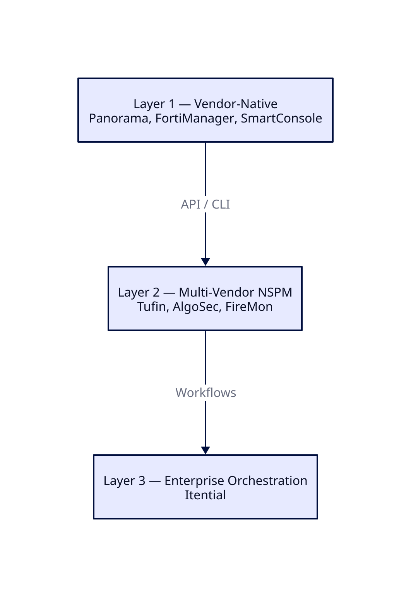
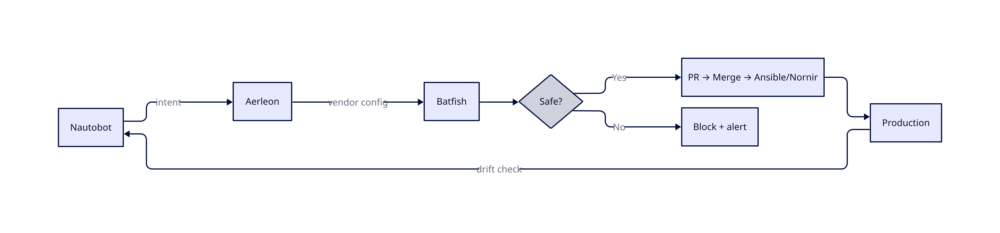

<!-- _class: lead -->
<!-- _header: '' -->

# Firewall Automation
## Simplifier d'abord

Vendor-agnostic. Sans hype.
Raisonnement pratique sur l'opportunité de l'automatisation pour vous.

**Adrien Nelis** — Network Security Architect

---

## La thèse

L'automatisation n'est pas une destination.

> **La simplification est le prérequis à l'automatisation,
> pas une tâche secondaire.**

Sauter les devoirs et on automatise son propre dysfonctionnement — plus vite et à plus grande échelle.

---

## Pourquoi c'est important

La gestion des firewalls est cassée dans la plupart des organisations.

Pas parce que les équipes manquent d'outils — mais parce qu'elles manquent de clarté.

- Les règles s'accumulent pendant des années
- Pas de propriétaires, pas d'expiration, pas d'objectif documenté
- L'automatisation via une plateforme NSPM ne règle pas ça
- **Elle l'amplifie**

---

## Pression moderne — Deux directions

**Standards techniques → plus de granularité**
- Zero Trust, microsegmentation
- Identity-aware policy
- Layer 7 inspection
- Rule lifecycle avec expiration

**Business/régulateurs → plus d'accountability**
- Continuous compliance (PCI-DSS, NIS2, ISO 27001)
- Full audit trail
- Application mapping
- Speed & agility pour les équipes dev

---

## Les chiffres qui devraient faire peur

Données enterprise FireMon 2026 :

| Métrique | % |
|--------|---|
| Règles complètement inutilisées | 30% |
| Objets applicatifs sans utilisation | 95% |
| Objets de service sans utilisation | 82% |
| Règles shadowed ou redondantes | 10% |
| Règles sans propriétaire | 6% |

C'est ce qui se retrouve automatisé quand on saute les devoirs.

---

## Les 9 pièges de l'automatisation

1. Automatiser avant de simplifier
2. Le réflexe outil
3. L'automatisation partielle
4. Aucun plan de rollback
5. L'ownership disparaît
6. Automatiser l'exception
7. La vitesse comme seule métrique
8. Le staging ne reflète pas la production
9. Croire que l'automatisation remplace les outils vendor-natifs

---

## Par où commencer — 4 phases

Ce n'est qu'après ces quatre phases que l'automatisation a du sens.

---

## Phase 1 — Gouvernance

- Prendre une baseline **NIST / ISO 27001 / CIS** — ne pas inventer la sienne
- Documenter la politique réseau interne
- Définir l'appétit pour le risque et les limites d'exposition

**Groupe de travail : 3–5 personnes max.**

Une gouvernance custom diverge de la réalité en moins d'un trimestre.

---

## Phase 2 — Audit

- Inventaire complet des règles sur tous les firewalls
- Analyse d'utilisation (90–180 jours)
- Détecter les règles shadow et les doublons
- Identifier les lacunes d'ownership

Les chiffres surprennent toujours l'équipe.

C'est la première conversation honnête qu'on peut avoir.

---

## Phase 3 — Simplifier

- Supprimer les règles inutilisées et shadowed
- Consolider les règles qui se chevauchent
- Remplacer les IPs par des objets nommés : `APP-CRM-PROD`, pas `10.2.4.0/24`
- Appliquer la convention de nommage — sans exceptions

**Objectif :** une base de règles qu'une machine peut raisonner.

---

## Phase 4 — Lifecycle

- Workflow de demande défini
- Expiration obligatoire sur chaque règle
- Cycle de revue annuel
- Source of Truth faisant autorité (Nautobot / NetBox)

**Organisationnel, pas technique.**

Sans ça, la base de règles revient à son état précédent dans les 18 mois.

---

## Processus de rule lifecycle

---

## La réalité des coûts — Phase de préparation

| Tâche | Fourchette typique |
|------|---------------|
| Gouvernance & politique | 2–4 semaines |
| Audit des règles | 1–4 semaines |
| Nettoyage & simplification | **2–6 mois (longue traîne)** |
| Conception des processus | 1–2 semaines |
| Formation & adoption | En continu |

**Pas bon marché. Pas optionnel.**
Chaque raccourci resurgit plus tard.

---

## Avez-vous réellement besoin d'automatisation ?

Trois facteurs :

- **Échelle** — 200 règles vs 15 000 règles
- **Capacité de l'équipe** — la discipline peut-elle tenir manuellement ?
- **Taux de changement** — demandes hebdomadaires ou environnement stable ?

**Les devoirs seuls délivrent une valeur énorme.**
L'automatisation pérennise et accélère. Ce n'est pas le moteur.

---

## Les routes à éviter

- Ne pas construire sa propre plateforme d'orchestration
- Ne pas automatiser sans Source of Truth
- Ne pas sauter la validation pré-déploiement
- Ne pas automatiser une base de règles sale
- Ne pas traiter l'automatisation comme un projet one-shot
- Ne pas ignorer le Day-2 operations gap
- Ne pas automatiser sans rollback
- Ne pas laisser le vendor choisir son architecture
- Ne pas attendre de l'IA qu'elle règle les fondamentaux

## Le financement est le prédicteur n°1

**Projets pleinement financés :** 80% de taux de succès

**Sous-financés :** 29% de taux de succès

Budgéter pour :
- Licence de plateforme **ou** temps ingénieur
- Formation (Git, Ansible/Terraform)
- Environnement de staging qui reflète la production
- Mainteneur dédié — l'automatisation ne se gère pas seule

---

## Les routes qui fonctionnent

- **Valider avant de déployer** — Batfish, modélisation mathématique offline
- **Automatiser l'hygiène en premier** — règles inutilisées, drift detection, conformité
- **Financer correctement** — 80% de succès vs 29% sous-financé
- **Hybride build AND buy** — 80% commercial, 20% custom
- **GitOps comme plan de contrôle** — historique Git = piste d'audit

---

## Industry Landscape

Trois catégories, des problèmes différents :

1. **Commercial global** — Tufin, AlgoSec, FireMon (américains/israéliens)
2. **Commercial européen** — Ruleblade, Stormshield, genua (EU souverain, NIS2/DORA)
3. **Open source** — Nautobot + Batfish + Aerleon (briques de construction)

**Mapper à son problème avant d'acheter.**

---

## Les trois layers

**Layer 2/3 orchestrent entre les vendors. Ils ne remplacent pas Layer 1.**

---

## Policy-as-Code — Stack open-source

Viable avec des compétences Python/DevOps. Pas clé en main.

---

## Options souveraines européennes

Si la souveraineté des données, NIS2 ou DORA sont des exigences fermes :

- **Ruleblade** (France) — seul NSPM complet EU-based
- **Stormshield** (France) — certifié ANSSI, gestion SMC
- **genua** (Allemagne) — certifié BSI EAL4+, basé Ansible
- **LANCOM** (Allemagne) — LMC cloud, hébergé en Allemagne
- **Clavister** (Suède) — carrier-grade, télécoms/défense

**Le gap :** aucun vendor EU ne correspond encore à la profondeur enterprise de Tufin/AlgoSec.

---

## IA — Où elle aide vraiment

Pas dans l'automatisation. Dans les **devoirs**.

- **Audit** — inventaire et corrélation de règles en heures vs semaines
- **Gouvernance** — rédiger des frameworks et conventions de nommage
- **CMDB** — nettoyer les données d'inventaire
- **Traduction** — migration de règles entre vendors

**L'IA compresse la préparation. Elle ne remplace pas les décisions.**

---

## Choisir son chemin (1/3)

### Besoin du Layer 2 par-dessus le Layer 1 ?

**Raisons valables :** trop de vendors, lacunes de fonctionnalités, workflows multi-écosystèmes.

**Raisons invalides :**
- _"Pas de compétences dans l'équipe"_ — Layer 2 est une couche plus haut. Fondations cassées.
- _"Pas le temps"_ — ce temps sera quand même dépensé, juste plus tard.

**La plupart des équipes n'utilisent que 60% de ce que Layer 1 fournit déjà.**

---

## Choisir son chemin (2/3)

### Open source vs commercial

**Open source viable quand :**
- Compétences Python/DevOps en interne
- Échelle modérée (pas 15k+ devices)
- On achètera du support payant pour les composants critiques

**Commercial viable quand :**
- Orchestration multi-vendor à grande échelle
- Zéro tolérance pour le DIY dans le reporting de conformité
- On a besoin d'un vendor à qui escalader

La plupart des environnements matures fonctionnent en **hybride**.

---

## Choisir son chemin (3/3)

### Ne pas vibe-coder son NSPM

**Le périmètre est énorme.** L'IA génère des pièces, pas une architecture cohérente.

**La validation est de niveau recherche.** Batfish a nécessité des années de travail académique.

**Les preuves de conformité n'existent pas.** Les auditeurs n'accepteront pas "l'IA l'a écrit."

**Écrire le glue — jamais le moteur.**

---

## Conclusion

Pour réussir avec l'automatisation, on passe par des étapes douloureuses en premier :
Gouvernance, audit, simplification, lifecycle, source of truth.

**Le retournement :** une fois qu'on les fait, on peut réaliser que l'automatisation n'était pas ce dont on avait besoin.

Ce dont on avait besoin, c'était la discipline pour affronter sa dette technique.

Nettoyer ça, c'est la vraie victoire — avec ou sans outil.

> **Simplifier d'abord. Ensuite décider si l'automatisation est nécessaire.**

---

## À propos de l'auteur

**Adrien Nelis** — Network Security Architect

15 ans dans les domaines réseau, sécurité et programmation.
Geek de nature, direct par défaut.

Ce document reflète les deux.

LinkedIn : [adrien-nelis](https://www.linkedin.com/in/adrien-nelis/)

---

<!-- _class: lead -->
<!-- _header: '' -->

## Whitepaper complet

[Firewall Automation: Simplify First](https://github.com/creadri/otterit-docs/tree/dev/Automation/Automation.pdf)

60+ sources citées.
Tous les diagrammes, données et détails vendor.

Merci.

---

<!-- _class: lead -->
<!-- _header: '' -->

## Licence

© Adrien Nelis — [CC BY 4.0](https://creativecommons.org/licenses/by/4.0/)

Libre de partager et d'adapter — attribution requise.
