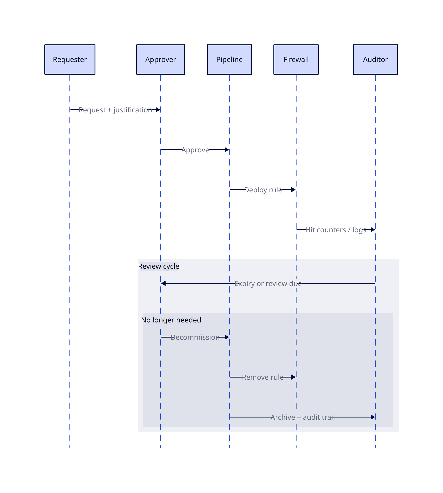
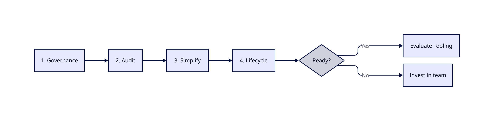
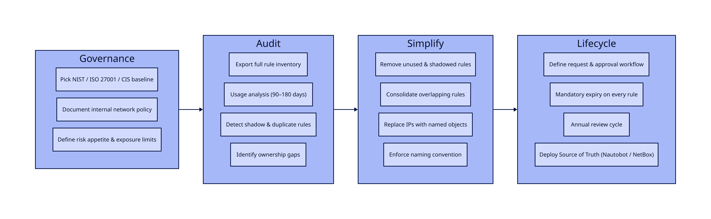
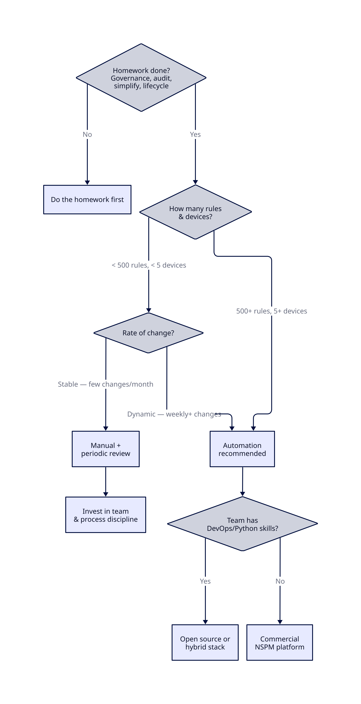
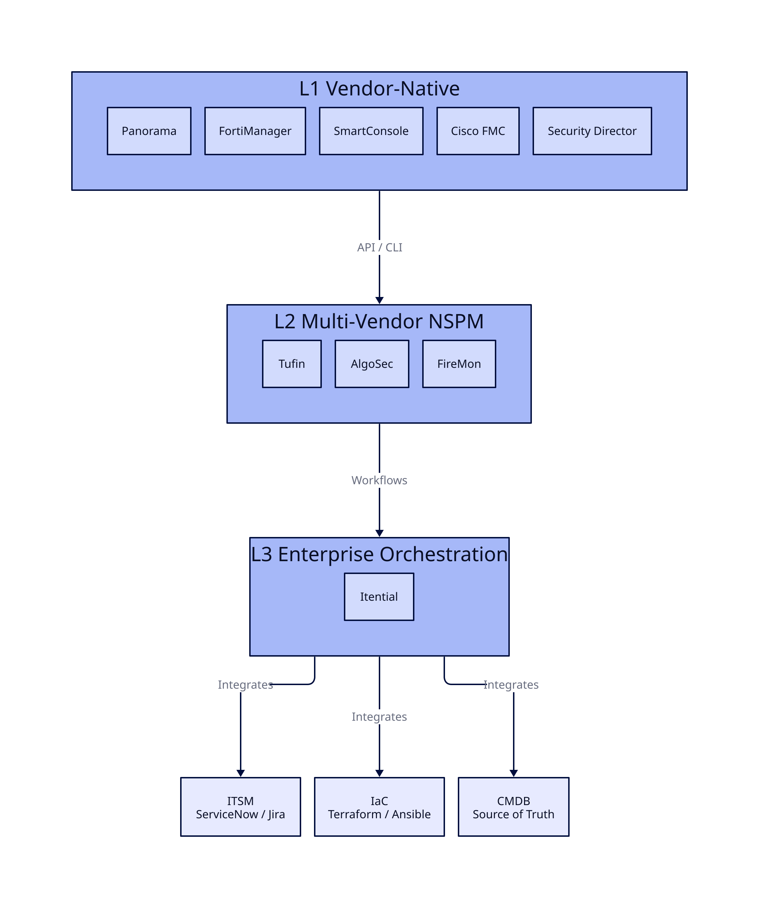
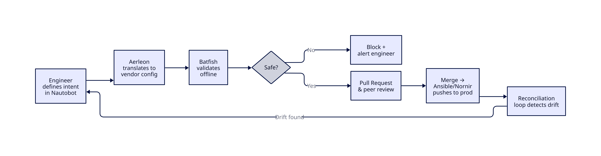

# Firewall Automation : Simplifier d'abord

_Vendor-agnostic. Sans hype. Raisonnement pratique sur l'opportunité de l'automatisation pour vous — et ce qu'il faut faire avant de toucher au moindre outil._

## Objectif

Comprendre ce que l'automatisation requiert réellement — et ce qu'il faut maîtriser avant de commencer.

## Pourquoi c'est important

La gestion des firewalls est cassée dans la plupart des organisations. Pas parce que les équipes manquent d'outils — mais parce qu'elles manquent de clarté. Les règles s'accumulent pendant des années sans propriétaire, sans expiration, sans justification documentée. L'automatisation via une plateforme Network Security Policy Management (NSPM) ne règle pas ça. Elle l'amplifie.

Ce document défend une seule idée : **la simplification est le prérequis à l'automatisation, pas une tâche secondaire.**

## Le problème de la gestion des règles firewall

Si quelqu'un gère vos règles firewall à la main, c'est du legacy — peu importe la modernité de votre matériel.

La pression sur la gestion des firewalls vient de deux directions : les standards techniques qui poussent vers plus de granularité, et les exigences métier et réglementaires qui poussent vers plus d'accountability.

**Ce que les standards de sécurité modernes exigent :**

- **Zero Trust** — default-deny partout, pas seulement au périmètre
  - La confiance par zone large est morte : "Internal" n'est pas une frontière de sécurité
  - Microsegmentation : le trafic est-ouest contrôlé, pas seulement nord-sud
- **Identity-aware policy** — règles liées au contexte utilisateur, device et application, pas aux IPs brutes
  - Une IP ne dit rien sur qui ou quoi communique
- **Layer 7 inspection** — visibilité applicative, pas seulement port/protocole
  - Le port 443 porte tout désormais ; les règles L4 sont aveugles à ce qui s'y passe
- **Rule lifecycle** — chaque règle doit avoir un propriétaire, une justification et une expiration
  - Une règle sans expiration est une règle que personne ne supprimera jamais

**Ce que les entreprises et les régulateurs exigent :**

- **Continuous compliance** — prouver à tout instant que la configuration correspond à la politique (PCI-DSS, NIS2, ISO 27001)
  - Drift detection : signaler quand la réalité diverge de l'état souhaité
- **Full audit trail** — qui a modifié quelle règle, quand, et pourquoi
  - Pas juste une entrée CMDB — un historique traçable et infalsifiable
- **Application mapping** — chaque règle liée à une application ou un service métier
  - Permet l'analyse d'impact : "qu'est-ce qui casse si je décommissionne cette app ?"
- **Change accountability** — pas de règle sans ticket, sans propriétaire et sans cycle de revue
  - Les régulateurs n'acceptent pas "on l'a hérité" comme réponse
- **Speed and agility** — les équipes dev et ops ne peuvent pas attendre 3 semaines pour une règle firewall
  - Le cloud et les pipelines CI/CD avancent vite ; les processus firewall manuels sont un goulot d'étranglement
  - Les demandes de règles deviennent une source de friction et de shadow IT : les équipes contournent le processus firewall plutôt que de le suivre
  - L'équipe réseau se fait reprocher de ralentir la livraison — même quand le vrai problème est l'absence d'un processus scalable

Alors — est-ce que l'automatisation règle ça ?

## Les pièges de l'automatisation

L'automatisation devient un piège quand elle est traitée comme une destination plutôt qu'une discipline. Les outils sont rarement le problème. Les pièges ci-dessous, si.

### Piège 1 — Automatiser avant de simplifier

L'erreur la plus courante. Les équipes héritent d'une base de règles avec des milliers d'entrées — sans propriétaires, sans expiration, avec des périmètres qui se chevauchent, des règles fantômes — et cherchent immédiatement un outil pour la gérer.

**Pourquoi c'est un piège :** L'automatisation requiert un modèle cohérent et rationnel sur lequel opérer. Les bases de règles legacy ne le sont pas. L'outil échoue soit à importer la config proprement, soit — pire — il réussit : et maintenant vous déployez des règles incohérentes à grande échelle, plus vite qu'avant. Garbage in, garbage out, automatisé.

### Piège 2 — Le réflexe outil

Les achats pilotent le projet. Le vendor fait une démo de sa plateforme, elle impressionne, le budget est validé. La question de processus — _comment voulons-nous réellement gérer les règles ?_ — vient après.

**Pourquoi c'est un piège :** L'outil façonne le processus au lieu que le processus façonne l'outil. Les équipes finissent par tordre leurs workflows pour s'adapter aux hypothèses du produit. Quand l'outil ne colle pas à la réalité, les contournements s'accumulent — et on a ajouté une couche de complexité sur de la complexité existante.

### Piège 3 — L'automatisation partielle

On automatise le déploiement des règles, mais on laisse l'expiration, les cycles de revue et le nettoyage en manuel. Ou on automatise les demandes de changement mais pas le contrôle de conformité. Le pipeline est automatisé ; le lifecycle ne l'est pas.

**Pourquoi c'est un piège :** L'automatisation partielle donne une fausse impression de contrôle. Les règles sont déployées plus vite mais ne sont jamais nettoyées. La base de règles grossit plus vite qu'avant. Les contrôles de conformité échouent toujours parce que la seconde moitié du lifecycle — revue, retrait, audit — n'était pas dans le périmètre.

### Piège 4 — Aucun plan de rollback

L'automatisation est construite, testée en staging, déployée en production. Personne n'a défini ce qui se passe quand un ruleset poussé casse la connectivité. Pas de procédure de rollback. Pas de chemin de récupération testé.

**Pourquoi c'est un piège :** Les changements manuels échouent un device à la fois. Les changements automatisés échouent partout simultanément. Le blast radius est proportionnel à la portée de l'automatisation. Sans rollback testé, un incident devient une crise — et l'organisation perd confiance dans l'automatisation, souvent de façon permanente.

### Piège 5 — L'ownership disparaît

Avant l'automatisation : un ingénieur réseau pousse chaque changement manuellement et en est implicitement propriétaire. Après l'automatisation : un pipeline pousse les changements. Qui est propriétaire d'une règle maintenant ? Qui est responsable quand quelque chose casse ?

**Pourquoi c'est un piège :** L'automatisation dilue l'accountability. Les équipes supposent que le système gère ; le système suppose qu'un humain surveille. Les règles orphelines se multiplient parce que personne ne se sent responsable de les nettoyer. Les incidents prennent plus longtemps à diagnostiquer parce que la chaîne de propriété est floue.

### Piège 6 — Automatiser l'exception

Chaque base de règles a ses cas particuliers — règles ponctuelles pour un serveur spécifique, un accès temporaire accordé il y a deux ans, un protocole legacy sans expression de politique propre. Les équipes essaient de codifier chaque exception dans le modèle d'automatisation.

**Pourquoi c'est un piège :** Les exceptions brisent le modèle déclaratif dont dépend l'automatisation. Plus il y a d'exceptions encodées, plus le système est fragile. La bonne réponse est d'éliminer les exceptions avant d'automatiser — pas de construire un système assez complexe pour les accueillir toutes.

### Piège 7 — La vitesse comme seule métrique

L'automatisation est vendue en interne sur la vitesse : les demandes de règles passent de semaines à minutes. Ça devient la métrique phare. Rien d'autre n'est mesuré.

**Pourquoi c'est un piège :** La vitesse sans précision est pire que la lenteur. Une règle déployée en 5 minutes qui viole le least-privilege, crée un écart de conformité ou entre en conflit avec une politique existante n'est pas une victoire. Mesurer uniquement la vitesse incite à supprimer les étapes de revue qui détectent ces problèmes. Les bonnes métriques incluent la qualité des règles, le taux de drift et la posture de conformité — pas seulement le time-to-deploy.

### Piège 8 — Le staging ne reflète pas la production

L'automatisation est testée en lab. Le lab a 50 règles. La production en a 8 000. Le lab a un seul vendor firewall. La production en a trois. Le lab n'a pas de dépendances stateful entre règles.

**Pourquoi c'est un piège :** Les bugs qui n'apparaissent qu'à grande échelle ou sous des interactions de règles spécifiques ne surgiront pas en test. Le premier vrai test devient la production — avec du trafic réel, un impact réel. Sans environnement de staging qui reflète significativement la topologie et la complexité des règles en production, les tests automatisés donnent une fausse confiance.

### Piège 9 — Croire que l'automatisation remplace les outils vendor-natifs

Les équipes supposent qu'une plateforme NSPM ou une stack d'automatisation custom va remplacer Panorama, FortiManager ou SmartConsole. Alors elles suppriment les licences de gestion vendor pour financer le projet d'automatisation.

**Pourquoi c'est un piège :** Les plateformes NSPM orchestrent _entre_ les vendors — elles ne répliquent pas ce que les outils vendor-natifs font _au sein_ de leur écosystème. Les device groups de Panorama, l'orchestration SD-WAN de FortiManager, les dynamic policy layers de Check Point — ce sont des capacités profondes et vendor-spécifiques qu'aucun outil cross-vendor ne reproduit. Supprimer la gestion vendor-native pour économiser du budget signifie perdre des fonctionnalités utilisées activement : gestion du lifecycle firmware, contrôle du failover HA, flux de threat intelligence vendor-spécifiques, diagnostics matériels. La couche d'automatisation se situe _au-dessus_ de la Layer 1 (voir Industry Landscape) — elle ne la remplace pas.

## Par où commencer

Maintenant qu'on sait quoi éviter, concentrons-nous sur ce qui doit se passer EN PREMIER — avant même que l'automatisation soit sur la table.

### 1 — Définir la baseline de gouvernance et de conformité réglementaire

Avant de toucher une règle ou un outil, établir ce qu'on est réellement tenu de faire — en interne et en externe.

- **Réglementations externes :** identifier quels frameworks s'appliquent (PCI-DSS, NIS2, ISO 27001, SOC2, lois locales de protection des données). Chacun a des exigences spécifiques sur le contrôle d'accès, les pistes d'audit et la gestion des changements. On ne peut pas concevoir un rule lifecycle sans savoir quelles preuves on doit produire.
- **Politique interne :** documenter ce que la politique de sécurité de l'organisation dit réellement sur l'accès réseau. Si elle n'existe pas, la rédiger — même une seule page. L'automatisation applique une politique ; sans politique, l'automatisation n'a rien à appliquer.
- **Appétit pour le risque :** comprendre ce que l'organisation considère comme une exposition acceptable. Ça pilote des décisions comme la rigueur nécessaire de la segmentation et la durée de vie d'une règle temporaire.

Ne pas inventer son propre framework de gouvernance de zéro. Choisir un standard établi — NIST, ISO 27001, CIS Controls — et adopter ses sections pertinentes pour les firewalls. N'adapter que ce qui est strictement nécessaire. Ces frameworks offrent une structure éprouvée, une reconnaissance réglementaire et un langage commun pour les auditeurs. Une gouvernance custom prend des mois de réunions, produit des documents que personne ne lit, et diverge de la réalité en moins d'un trimestre.

Garder le groupe de travail à 3–5 personnes. Chaque personne supplémentaire ralentit la convergence et ajoute des opinions sans valeur proportionnelle.

Le résultat de cette étape est une réponse claire et écrite à : _à quoi ressemble une règle bien gérée et conforme dans notre environnement ?_

### 2 — Auditer l'état actuel

On ne peut pas simplifier ce qu'on n'a pas mesuré. Avant tout nettoyage, dresser un tableau complet de ce qui existe.

- **Inventaire complet des règles :** exporter chaque règle de chaque firewall, sur toutes les plateformes et tous les sites
- **Analyse d'utilisation :** identifier les règles sans trafic sur les 90–180 derniers jours — candidats sérieux à la suppression
- **Règles fantômes et doublons :** règles jamais atteintes parce qu'une règle plus large au-dessus les intercepte déjà
- **Lacunes d'ownership :** règles sans ticket associé, sans propriétaire nommé, sans objectif documenté
- **Distribution par âge :** quelle est l'ancienneté de la base de règles ? Les règles de plus de 3 ans sans revue sont une dette

La plupart des équipes sont surprises par les chiffres. Les données enterprise 2026 de FireMon montrent : 30 % des règles totalement inutilisées, 95 % des objets applicatifs et 82 % des objets de service avec zéro utilisation, 10 % des règles redondantes ou shadowed, et 6 % sans propriétaire ni documentation. Le chemin de maturité validé par les analystes (IDC, Gartner) place la Visibilité en Phase 1 — avant la Gouvernance, avant l'Automatisation, avant la Résilience. Obtenir ces chiffres est la première conversation honnête qu'on peut avoir sur le problème.

### 3 — Simplifier et standardiser

C'est l'étape la plus difficile et la plus importante. L'objectif est de réduire la base de règles à quelque chose qu'une machine peut raisonner.

**Réduire le nombre de règles :**

- Supprimer les règles inutilisées et shadowed (avec change control et tests appropriés)
- Consolider les règles qui se chevauchent en entrées plus larges et plus propres
- Remplacer les règles par host individuel par des règles basées sur des groupes ou tags

**Introduire de l'abstraction :**

- Arrêter d'écrire des règles contre des IPs brutes — les IPs changent, se déplacent, sont réassignées
- Utiliser des objets nommés, des groupes et des tags qui correspondent à un sens métier : `APP-CRM-PROD`, `NET-DATACENTER-DMZ`, pas `10.2.4.0/24`
- Définir des zones qui reflètent le vrai modèle de sécurité, pas l'historique VLAN

**Standardiser le nommage et la structure :**

- Convention de nommage cohérente pour tous les objets et règles : appliquée, pas suggérée
- Chaque règle doit avoir : propriétaire, justification métier, date de création, date de revue/expiration
- Pas d'exceptions — y compris les règles antérieures à la politique

**Pourquoi ça débloque l'automatisation :** les outils d'automatisation travaillent sur des modèles déclaratifs et cohérents. Une base de règles construite sur des objets nommés avec une propriété claire peut être exprimée en code. Une base de règles construite sur des IPs brutes et de la connaissance tribale ne le peut pas.

### 4 — Établir un processus de rule lifecycle

La simplification règle le passé. Un processus de lifecycle empêche le problème de se reproduire.

- **Workflow de demande :** chaque demande de règle passe par un processus défini — qui peut demander, qui approuve, quelle justification est requise
- **Expiration obligatoire :** aucune règle n'est permanente par défaut. Chaque règle reçoit une date de revue à la création. Les règles temporaires reçoivent une expiration ferme.
- **Cycle de revue :** toutes les règles revues au moins annuellement. Pas de réponse du propriétaire = règle signalée pour suppression.
- **Processus de décommissionnement :** quand une application est retirée, ses règles sont supprimées. Cela doit être appliqué — pas optionnel.

**Ancrer sur une Source of Truth faisant autorité.** Un processus de lifecycle a besoin d'un système de référence. Des plateformes comme Nautobot ou NetBox fournissent des modèles de données structurés pour la gestion des adresses IP, l'inventaire des devices et le mapping des services — avec intégration Git et accès API. Le Data Validation Engine de Nautobot détecte la duplication de règles et les chevauchements dangereux avant que la politique ne soit appliquée. Son application Golden Config génère les configurations attendues, exécute des backups automatisés et applique les remédiation de conformité. L'essentiel : la source of truth doit être le _seul_ endroit où l'état réseau est défini. Deux sources of truth = aucune.

Cette étape est organisationnelle, pas technique. Elle nécessite l'adhésion des équipes sécurité, réseau et applicatifs. Sans elle, la base de règles reviendra à son état précédent dans les 18 mois — peu importe l'automatisation mise par-dessus.

Ce n'est qu'après avoir complété ces quatre étapes qu'il est pertinent d'évaluer les outils d'automatisation. À ce stade, on dispose d'une base de règles propre, d'un modèle cohérent, d'une propriété définie et d'un processus pour la maintenir. L'automatisation a quelque chose sur quoi travailler.

Décomposition des tâches par phase :

## Analyse des coûts

Le business demandera un ROI avant de valider quoi que ce soit. Légitime. Mais en construire un honnête requiert de répondre à quatre questions — dans le bon ordre.

### 1 — Combien ça vous coûte actuellement ?

On ne peut pas calculer un ROI sans baseline. La plupart des organisations n'ont jamais mesuré le vrai coût de la gestion manuelle des firewalls — il est distribué entre les équipes et noyé dans la surcharge opérationnelle.

**Coûts directs à mesurer :**

- **Temps FTE sur la gestion des règles :** combien d'heures par semaine les ingénieurs passent-ils sur les demandes de règles, les revues, le troubleshooting et les audits ? Suivre ça sur un mois — c'est toujours plus élevé que ce qu'on estime.
- **Coût des incidents liés aux mauvaises configurations :** pannes causées par des règles incorrectes, oubliées, en conflit. Inclure le downtime, les heures de war room et l'effort de post-mortem.
- **Coût d'audit et de conformité :** temps de préparation aux audits, effort de remédiation quand les findings reviennent, coût des auditeurs ou consultants externes.
- **Coût d'opportunité :** que font _pas_ ces ingénieurs parce qu'ils poussent des règles firewall ? Projets retardés, dette technique non traitée, améliorations de sécurité reportées.

**Coûts indirects à reconnaître :**

- Shadow IT et contournements quand le processus de demande de règles est trop lent
- Exposition de sécurité liée à des règles qui auraient dû être supprimées mais ne l'ont pas été
- Frustration des équipes et risque de turnover dû au travail manuel répétitif

Obtenir de vrais chiffres. Même des estimations approximatives rendent l'argument concret. "Notre équipe passe environ 30 heures par semaine sur des opérations manuelles de règles" est plus puissant que n'importe quel calculateur ROI d'un vendor.

### 2 — Combien coûte la phase de préparation ?

Avant qu'un outil d'automatisation n'entre dans le tableau, les étapes "Par où commencer" doivent être complétées : gouvernance, audit, simplification, processus de lifecycle. Cette phase a un coût réel.

Par expérience, le coût le plus important ici n'est pas technique — c'est organisationnel. Il implique des réunions, des alignements et des décisions qui avancent lentement dans les grandes organisations.

**Comment garder cette phase légère :**

- **KIS — Keep It Simple.** Ne pas inventer son propre framework de gouvernance. Prendre un standard existant (NIST, ISO 27001, CIS Controls), adopter ses sections pertinentes pour les firewalls, et n'adapter que ce qui est strictement nécessaire.
- **Petites équipes.** Garder les groupes de décision à 3–5 personnes. Plus de personnes à la table = convergence plus lente, plus d'opinions, moins d'actions.
- **Phases avec délais.** Fixer des deadlines pour la définition de la gouvernance, la complétion de l'audit et les jalons de nettoyage. Sans deadlines, cette phase s'étire indéfiniment.

**Composantes du coût :**

| Élément | Fourchette typique |
|---|---|
| Définition de la gouvernance et des politiques | 2–4 semaines d'effort concentré (petite équipe) |
| Audit des règles et analyse d'utilisation | 1–4 semaines selon les outils et le nombre de règles |
| Nettoyage et simplification des règles | 2–6 mois (la longue traîne — nécessite des tests et des change windows) |
| Conception des processus et documentation | 1–2 semaines |
| Formation et adoption | En continu, faible intensité |

Pas bon marché, mais pas optionnel. Chaque raccourci ici resurgit comme un piège plus tard. Bonne nouvelle — la majeure partie de ce travail délivre de la valeur _avant_ même que l'automatisation commence. Une base de règles propre avec propriété et lifecycle est déjà une amélioration massive.

### 3 — Combien coûte l'automatisation ?

Une fois les fondations en place, l'automatisation elle-même a une enveloppe de coût.

**Coûts outillage :**

- **Plateformes d'orchestration commerciales** (Tufin, AlgoSec, FireMon, etc.) : frais de licence, typiquement par device géré ou par nombre de règles. Budget très variable — de dizaines à centaines de milliers d'euros annuels selon l'échelle.
- **Approche open-source / in-house** (Ansible, Terraform, scripts custom) : pas de coût de licence, mais du temps ingénieur pour construire, maintenir et supporter. Pas gratuit — juste payé en salaire plutôt qu'en licence.
- **Automatisation vendor-native** (Panorama, FortiManager, FMC) : inclus dans le coût de la plateforme existante, mais limité à l'écosystème de ce vendor.

**Intégration et déploiement :**

- Connexion de l'automatisation à l'ITSM (ServiceNow, Jira), au CMDB, au SIEM/SOAR
- Construction ou configuration du pipeline CI/CD pour le déploiement des règles
- Mise en place d'un environnement de staging qui reflète la topologie de production
- Conception et test du mécanisme de rollback

**Coûts opérationnels :**

- Maintenance continue des pipelines d'automatisation et des intégrations
- Formation : les ingénieurs réseau ont besoin de compétences IaC (Git, bases Ansible/Terraform)
- Au moins une personne qui possède la plateforme d'automatisation — elle ne se gère pas seule

### 4 — Quel est le retour attendu ?

Avec les trois réponses précédentes en main, le ROI est une arithmétique simple. Mais être réaliste sur ce qu'on peut revendiquer.

**Retours mesurables :**

- **Temps FTE récupéré :** si les opérations manuelles coûtent X heures/semaine, de combien l'automatisation réduit-elle ça ? Rarement 100 % — 50–70 % est une cible crédible.
- **Livraison de règles plus rapide :** de semaines à heures/jours. La valeur dépend de l'impact métier que le délai actuel génère.
- **Réduction des incidents :** moins de mauvaises configurations = moins de pannes. Utiliser les données d'incidents actuelles comme baseline.
- **Réduction de l'effort d'audit :** la compliance continue remplace la collecte manuelle de preuves. Les audits passent de semaines de préparation à quasi-zéro.

**Plus difficile à quantifier mais réel :**

- Réduction de l'exposition de sécurité grâce à l'expiration et au nettoyage automatisés des règles
- Amélioration du moral et de la rétention des équipes
- Onboarding plus rapide des nouveaux membres (le processus est documenté et appliqué, pas tribal)

**Ce qu'il ne faut PAS revendiquer :**

- Réduction à 100 % de l'effort manuel — il y aura toujours des exceptions, des escalades et des cas limites
- ROI immédiat — la phase de préparation prend des mois avant que l'automatisation délivre de la valeur
- Zéro incident — l'automatisation réduit les erreurs humaines mais introduit de nouveaux modes de défaillance

**Le pitch honnête aux dirigeants :** la phase de préparation seule s'autofinance grâce à la réduction du rule sprawl, une meilleure posture de conformité et moins d'incidents. L'automatisation accélère et pérennise ces gains. Le ROI est réel — mais il est décalé dans le temps, pas immédiat.

## Avez-vous réellement besoin d'automatisation ?

Si vous avez lu jusqu'ici, une chose devrait être claire : les prérequis avant l'automatisation sont conséquents. Gouvernance, audit, simplification, processus de lifecycle — rien de tout ça n'est trivial. Ça prend des mois, une coordination inter-équipes et un effort soutenu.

Ce qui soulève une question inconfortable : **si vous faites correctement les devoirs, avez-vous encore besoin d'automatisation ?**

Il n'y a pas de réponse universelle. Ça dépend de trois facteurs :

**L'échelle.** Une organisation gérant 200 règles sur 3 firewalls a un problème fondamentalement différent de celle qui gère 15 000 règles sur 50 devices de 3 vendors. À petite échelle, une équipe disciplinée avec des règles propres et un processus solide n'a peut-être jamais besoin d'outillage d'orchestration. À grande échelle, le volume de changements, la charge de conformité et la surcharge de coordination rendent la gestion manuelle non viable, peu importe la qualité des ingénieurs.

**La capacité de l'équipe.** Si le processus de simplification a formé vos ingénieurs — s'ils comprennent maintenant les règles basées sur l'intention, le groupement d'objets, les standards de nommage et la discipline du lifecycle — ils sont peut-être capables de maintenir la qualité manuellement. De bons ingénieurs avec des processus clairs et une petite base de règles n'ont pas besoin d'une plateforme NSPM à six chiffres. Cela dit, même d'excellents ingénieurs font des erreurs sous pression, lors d'incidents ou après un départ. La valeur de l'automatisation ici est la consistance, pas l'intelligence.

**Le taux de changement.** Si votre environnement est stable — peu de nouvelles applications, des changements de règles peu fréquents, une infrastructure prévisible — la gestion manuelle avec des revues de conformité périodiques peut suffire. Si vous êtes dans un environnement piloté par CI/CD où les développeurs demandent des changements firewall chaque semaine, ou si vous gérez des security groups cloud qui se créent et se détruisent dynamiquement, les processus manuels deviendront le goulot d'étranglement peu importe la qualité de l'équipe.

L'évaluation honnête :

- **Les devoirs seuls délivrent une valeur énorme.** Une base de règles propre, possédée, standardisée avec des processus de lifecycle est déjà une amélioration massive par rapport au point de départ de la plupart des organisations. Beaucoup des bénéfices de sécurité et de conformité attribués à l'automatisation viennent en réalité de ce travail fondationnel.
- **L'automatisation pérennise et accélère les gains.** Elle empêche le drift, applique la consistance à l'échelle, réduit les erreurs humaines sous charge et libère les ingénieurs pour des travaux à plus haute valeur. Mais c'est un accélérateur, pas le moteur.
- **Ne pas automatiser est un résultat valide.** Si l'analyse de coûts montre que la gestion manuelle avec des contrôles de conformité périodiques est tenable pour votre échelle et votre taux de changement, alors la réponse est : faire les devoirs, passer les outils, et investir dans l'équipe à la place.

Le drift est inévitable même avec les meilleurs processus. Les règles s'accumulent, les exceptions s'insinuent, l'ownership se dégrade au fil des départs. La question est de savoir si on traite le drift via des revues manuelles périodiques ou via une détection automatisée continue. Les deux fonctionnent — à des échelles et des coûts différents.

Si la réponse penche vers "oui, automatiser" — la question suivante est _quel tier_ : le vendor-native (Layer 1) couvre peut-être déjà vos besoins, ou vous pourriez avoir besoin d'un NSPM cross-vendor (Layer 2) par-dessus. Cette décision est couverte dans "Choisir son chemin" plus loin.

## Les routes à éviter

Ce qui suit sont des approches qui semblent raisonnables sur le papier mais échouent systématiquement. Basé sur des données industrielles, des post-mortems et des patterns observés répétitivement.

### Ne pas automatiser sans Source of Truth

Si l'automatisation interroge une base de données avec des IPs obsolètes, de mauvaises associations de devices ou des tags de service périmés, elle exécutera flawlessly la mauvaise configuration.

**Pourquoi ça échoue :** L'automatisation fait confiance aveuglément à ses données. Quand un humain pousse une règle manuellement, il pourrait remarquer qu'une IP semble incorrecte ou qu'un hostname n'existe plus — et marquer une pause. Un pipeline automatisé n'a pas cet instinct. Il lit la base de données, génère la config, et la pousse. Si les données indiquent que le serveur X est à 10.2.4.5 mais que ce serveur a été décommissionné il y a trois mois, le pipeline créera volontiers une règle pointant vers rien — ou pire, vers ce qui occupe désormais cette adresse.

La plupart des organisations s'appuient encore sur des tableurs ou des CMDBs mal maintenus comme "source of truth". Les études montrent que ces derniers se dégradent de 5–10 % par mois sans mises à jour automatisées. Après un an, 40–70 % des entrées peuvent être obsolètes. Votre automatisation prend maintenant des décisions sur des données qui ne reflètent plus la réalité.

Sans une Source of Truth faisant autorité et mise à jour dynamiquement (plateformes comme Nautobot, NetBox ou un CMDB ServiceNow correctement maintenu), l'automatisation est une arme chargée pointée sur votre propre réseau.

### Ne pas sauter la validation pré-déploiement

"Ça marchait en lab" n'est pas une stratégie de déploiement. Pousser des changements de configuration sur des firewalls de production sans contrôles de sécurité mathématiques, c'est comme ça qu'on se met soi-même hors ligne.

**Pourquoi ça échoue :** Un cas documenté : un ingénieur a exécuté un changement automatisé de table de routage sur un subnet AWS, remplaçant accidentellement la route par défaut (0.0.0.0/0) par une route interne. Résultat : les serveurs recevaient du trafic entrant mais n'avaient aucun chemin pour répondre. Coupure totale des communications pendant 30 minutes. VP Engineering en appel d'urgence.

Le remède existe : des outils comme Batfish effectuent une analyse de configuration offline — ils ingèrent les changements proposés et modélisent mathématiquement l'état réseau résultant avant qu'un seul paquet ne soit affecté. Ils détectent les boucles de routage, les règles shadowed et les violations de conformité _avant_ le déploiement. Sauter cette étape pour gagner du temps est une fausse économie.

### Ne pas automatiser une base de règles sale

60 % des firewalls enterprise échouent aux contrôles de conformité haute sévérité lors de l'évaluation. 95 % des objets applicatifs configurés montrent zéro utilisation. 30 % de toutes les règles sont complètement inutilisées. 10 % sont redondantes ou shadowed.

**Pourquoi ça échoue :** Automatiser par-dessus ça signifie déployer — à la vitesse machine — une configuration déjà cassée. Chaque objet inutilisé, chaque règle shadowed, chaque entrée orpheline devient codifiée dans le pipeline d'automatisation. Le rule bloat dégrade les performances matérielles, masque les vraies vulnérabilités et crée des passifs de conformité. L'automatisation les fige et rend le nettoyage plus difficile, pas plus facile.

Nettoyer d'abord. Puis automatiser. Pas l'inverse.

### Ne pas traiter l'automatisation comme un projet one-shot

Les équipes implémentent l'automatisation, célèbrent le lancement, puis passent à d'autres priorités. Personne ne maintient le pipeline. Personne ne met à jour les templates de politique quand le firmware firewall change. Personne ne revoit le rule lifecycle automatisé.

**Pourquoi ça échoue :** Seulement 18 % des projets d'automatisation réseau réussissent complètement. Parmi les autres, 54 % atteignent des résultats partiels qui ne justifient pas l'investissement, et 28 % stagnent complètement. Le plus grand prédicteur de succès est le financement soutenu — les projets pleinement financés atteignent 80 % de taux de succès vs 29 % pour ceux sous-financés.

L'automatisation est une capacité opérationnelle, pas un projet. Elle nécessite une propriété continue, un mainteneur dédié (même à temps partiel) et un budget qui ne disparaît pas après la première année.

### Ne pas ignorer le Day-2 Operations Gap

Les outils Infrastructure-as-Code comme Terraform dominent le provisionnement Day-0 — démarrer des firewalls, configurer les rule sets initiaux. Les équipes supposent que le même outil gère tout.

**Pourquoi ça échoue :** L'IaC gère 20–30 % de la livraison de services réseau (la partie provisionnement). Les 70–80 % restants — opérations courantes, changements de logique métier, rollback, validation continue de conformité, lifecycle des règles — sont structurellement hors de ce pour quoi l'IaC a été conçu. Les équipes découvrent ce gap des mois après la mise en production, quand elles réalisent que Terraform peut déployer un firewall mais ne peut pas gérer le workflow quotidien de demandes de règles, expirer les règles inutilisées ou valider le drift de conformité.

Planifier le Day-2 dès le départ. Soit étendre l'IaC avec des couches d'orchestration (Itential, workflows custom) soit choisir une plateforme qui couvre le cycle de vie complet.

### Ne pas automatiser sans rollback

Si on peut pousser un changement en 5 secondes mais qu'on ne peut pas l'annuler en 5 minutes, l'automatisation est une dette.

**Pourquoi ça échoue :** Les changements manuels cassent un device à la fois. Les changements automatisés cassent tout simultanément — le blast radius est proportionnel à la portée du pipeline. Sans mécanisme de rollback testé et automatisé, un incident qui devrait prendre des minutes à résoudre devient une crise de plusieurs heures. Et l'organisation perd confiance dans l'automatisation — souvent de façon permanente.

Le rollback doit être conçu, construit et testé _avant_ que le premier changement automatisé parte en production. Pas après le premier incident.

### Ne pas laisser le vendor choisir votre architecture

Un vendor fait une démo de sa plateforme, elle impressionne, le budget est validé. L'architecture est ensuite façonnée autour de ce que l'outil suppose : son modèle de données, son workflow, ses points d'intégration.

**Pourquoi ça échoue :** On finit par tordre ses processus pour s'adapter au produit au lieu de l'inverse. Quand l'outil ne correspond pas à la réalité — et il ne correspondra pas pour chaque cas — les contournements s'accumulent. On a ajouté une couche de complexité sur de la complexité existante. Les environnements multi-vendors (87 % des entreprises) sont particulièrement vulnérables : un outil optimisé pour l'écosystème d'un vendor devient un goulot d'étranglement pour tout le reste.

Définir ses exigences, son workflow et son modèle de données d'abord. Puis évaluer les outils par rapport à ça — et non l'inverse.

### Ne pas attendre de l'IA qu'elle règle les fondamentaux

Les analyseurs de règles pilotés par IA peuvent réduire le temps d'audit de 95 %. Les interfaces en langage naturel permettent aux ingénieurs de décrire leur intention plutôt que d'écrire la syntaxe CLI. Ce sont de vraies capacités disponibles aujourd'hui.

**Pourquoi ça échoue quand mal appliqué :** L'IA peut identifier les règles inutilisées, suggérer des consolidations et signaler les écarts de conformité. Elle ne peut pas définir votre modèle de gouvernance, assigner la propriété des règles ou corriger une culture organisationnelle qui traite le firewall comme "le problème de quelqu'un d'autre." L'IA accélère l'analyse et la traduction — elle ne remplace pas le travail de simplification et de standardisation décrit dans les chapitres précédents.

Les organisations qui adoptent des plateformes IA avant d'avoir complété le travail fondationnel se retrouvent avec des outils très rapides et très sophistiqués produisant des rapports très précis sur une base de règles que personne ne veut changer.

### Ne pas vibe-coder votre NSPM

Une nouvelle option est apparue : vibe-coder son propre NSPM avec un assistant de code IA. Quelques mois d'itérations et on a quelque chose qui semble correct.

**Non.**

C'est l'inverse du rêve marketing vendor ("une plateforme fait tout"). C'est le même fantasme, juste inversé : "un développeur plus IA fait tout." Les deux sont faux.

**Pourquoi le NSPM vibe-codé échoue :**

- **Le périmètre est énorme.** Un vrai NSPM a besoin de parsing de config multi-vendor, modélisation de sémantique de règles, détection shadow/redondance, reporting de conformité, moteur de workflow de changement, audit logging, intégrations API, RBAC, gestion des secrets. L'IA peut générer n'importe quelle pièce individuelle. Elle ne peut pas tenir toute le système dans une architecture cohérente.
- **La validation est la partie difficile.** Pousser une règle est facile. Une validation mathématique équivalente à Batfish est un problème de niveau recherche — cela a pris des années de travail académique. Les LLMs ne court-circuitent pas ça.
- **La dette de maintenance est invisible au départ.** Les systèmes vibe-codés se cassent de façon imprévisible une fois que les APIs vendor changent, que les dépendances se mettent à jour ou que les cas limites remontent. Les prompts originaux ne sont pas de la documentation.
- **Les preuves de conformité n'existent pas.** Les auditeurs veulent des contrôles traçables et du code revu. "L'IA l'a écrit" n'est pas une réponse acceptable.

**Le custom complet sans IA est aussi une mauvaise idée.** Si c'était si simple, il y aurait plus de trois ou quatre vrais produits NSPM sur le marché. Une solution complète a de nombreux composants ; les réaliser correctement prend des années d'investissement en ingénierie.

**Quand le custom est réellement justifiable :**

- On est un hébergeur, un MSSP ou une plateforme cloud dont le _business_ est la gestion de firewalls à grande échelle. L'outillage est le produit.
- On a des exigences inhabituelles qu'aucun outil commercial ou open-source ne couvre (rare — mais ça existe).
- On construit de l'outillage interne opinionné _par-dessus_ des briques open-source (Nautobot + Aerleon + Batfish + UI custom). C'est différent du vibe-coding from scratch — on écrit le glue, pas le moteur.

Pour tout le monde d'autre : **ne pas réinventer le NSPM.** Utiliser les briques qui existent déjà. Écrire le glue, jamais le moteur.

## Les routes qui fonctionnent

Le travail fondationnel est couvert dans "Par où commencer". On repart de là — ce qui fonctionne réellement quand on commence à automatiser.

### Valider avant de déployer

Découpler la génération de configuration du déploiement. Chaque changement proposé passe par une analyse offline avant de toucher la production.

**Pourquoi ça fonctionne :** La vérification avant déploiement avec des outils comme Batfish (_vendor-agnostic, open-source_) ingère les configurations proposées et modélise l'état réseau résultant. Il vérifie les rule sets ACL, contrôle les chemins de flux, détecte les boucles de routage, les règles shadowed et les violations de conformité. Tout ça avant qu'un seul paquet soit affecté. Dans les refactorings à grande échelle (compresser des ACLs massives en supprimant les entrées redondantes), la validation offline accélère les délais de semaines tout en éliminant le risque de panne.

Le workflow : l'ingénieur soumet une Pull Request → le pipeline CI/CD extrait la topologie de la source of truth → traduit l'intention via le moteur de politique → valide la sécurité avec l'outil de vérification → revue par les pairs → merge → déploiement. Personne ne touche directement un firewall.

### Automatiser l'hygiène en premier

Ne pas commencer par l'automatisation end-to-end du rule lifecycle. Commencer par les tâches d'hygiène à faible risque et haute valeur qui construisent la confiance et montrent des résultats immédiats.

**Pourquoi ça fonctionne :** Trois points de départ éprouvés :

1. **Rule decommissioning** — automatiser la suppression des règles inutilisées et des entrées expirées. Priorité la plus basse pour les équipes occupées, valeur de sécurité la plus haute. Réduit immédiatement la surface d'attaque et récupère des ressources matérielles.
2. **Drift detection** — automatisation en lecture seule qui compare l'état souhaité à l'état réel et signale les divergences. Pas encore de changements automatisés — juste de la visibilité. Construit la confiance dans le modèle de données.
3. **Compliance reporting** — contrôles automatisés par rapport au framework choisi (CIS, NIST, PCI-DSS). Remplace des semaines de préparation d'audit manuelle par une validation continue.

Ces démarches sont à faible risque parce qu'elles ne poussent pas de changements sur les firewalls de production. Elles prouvent que le pipeline d'automatisation fonctionne, valident la source of truth et délivrent des victoires mesurables à montrer aux dirigeants.

### Financer correctement

Le plus grand prédicteur de succès de l'automatisation est l'engagement financier. Les projets pleinement financés atteignent 80 % de taux de succès. Les initiatives sous-financées : 29 %.

**Pourquoi ça fonctionne :** Le taux d'échec de 82 % est fortement biaisé vers les organisations qui ont essayé de le faire à moindre coût — outils low-code sur des problèmes multi-vendors complexes, ou automatisation confiée à une équipe déjà surchargée.

Budgéter pour : licence de plateforme ou temps ingénieur (choisir l'un des deux), formation (Git, bases Ansible/Terraform), un environnement de staging qui reflète la production et au moins un mainteneur à temps partiel pour les deux premières années.

### Adopter une stratégie hybride "Build AND Buy"

Acheter de l'orchestration commerciale pour les 80 % de workflows multi-vendors standards. Réserver le développement custom pour les 20 % de workflows qui sont genuinement propriétaires et génèrent une différenciation concurrentielle.

**Pourquoi ça fonctionne :** Les plateformes commerciales gèrent l'abstraction d'API multi-vendor, les SLAs, les frameworks de conformité et le support. Les scripts custom comblent les lacunes où le workflow est vraiment unique — mais seulement ces lacunes. Évite les deux extrêmes : "tout construire" (dépassement de coût de 300–500 %) et "tout acheter" (tordre son processus pour correspondre aux hypothèses d'un vendor).

### Utiliser GitOps comme plan de contrôle

Tous les changements firewall passent par Git. Pas d'accès CLI direct aux firewalls de production. Chaque changement est une Pull Request — revue, testée, mergée, puis déployée par le pipeline.

**Pourquoi ça fonctionne :** Git fournit une piste d'audit immuable (qui a changé quoi, quand, pourquoi), une revue par les pairs avant déploiement et un point d'intégration naturel pour les outils de validation. Une boucle de réconciliation continue détecte et annule tout changement manuel "hors-bande" effectué directement sur un firewall, éliminant le drift de configuration.

Ça résout aussi le problème de preuve de conformité : l'historique Git _est_ la documentation des changements. Les auditeurs obtiennent un enregistrement complet et infalsifiable sans que personne ne l'assemble manuellement.

## IA — Où elle aide vraiment

Chaque vendor NSPM a désormais des fonctionnalités IA. La plupart la présentent comme la couche d'automatisation — création de règles en langage naturel, génération de politiques basées sur l'intention, gestion des changements pilotée par IA. C'est de la vraie technologie, mais ce n'est pas là où l'IA délivre le plus de valeur pour la plupart des organisations.

L'IA brille le plus dans la phase de préparation — la partie que personne ne veut faire manuellement.

**L'audit.** L'IA peut ingérer des milliers de règles de multiples vendors et donner une analyse structurée en heures plutôt qu'en semaines. Règles inutilisées, règles shadowed, périmètres qui se chevauchent, écarts de conformité — exactement le travail d'inventaire décrit à l'étape 2 de "Par où commencer". Pas besoin d'une plateforme NSPM pour ça. Un LLM bien guidé avec votre base de règles exportée peut faire une corrélation et une analyse qui prendrait des jours à une équipe d'ingénieurs.

**La gouvernance et la documentation.** Rédiger des frameworks de gouvernance, des conventions de nommage, des procédures de lifecycle — l'IA est bonne pour rédiger des documents structurés à partir d'exigences. Elle ne remplacera pas les décisions (elles nécessitent toujours des humains autour d'une table), mais elle compresse le travail de rédaction et de mise en forme de semaines à heures.

**CMDB et inventaire.** Construire ou nettoyer un export CMDB — corréler des IPs à des hostnames à des applications à des propriétaires — est exactement le type de travail fastidieux et basé sur des patterns que l'IA gère bien. Lui fournir les sources de données, la laisser produire un inventaire draft, puis faire valider par des ingénieurs. Plus rapide et plus précis que de le faire manuellement depuis zéro.

**Traduction et migration de règles.** Déplacer des règles entre vendors ou plateformes (Cisco ASA vers Palo Alto, on-prem vers cloud security groups) est du travail de traduction. L'IA gère bien la conversion de syntaxe, et des outils comme Aerleon automatisent déjà ça — l'IA l'étend aux cas limites et aux configurations non standards.

Le point clé : **l'impact le plus important de l'IA est dans la préparation, pas dans l'automatisation.** Elle compresse les devoirs douloureux que ce document tout entier argue qu'on doit faire en premier. Si on cherche des gains rapides, commencer là — pas avec le déploiement de règles piloté par IA.

## Industry Landscape

Trois catégories d'outils adressent l'automatisation firewall aujourd'hui. Ils résolvent des problèmes différents — les mapper aux siens évite les erreurs les plus coûteuses.

- **Solutions commerciales globales** — leaders de marché américains/israéliens. Fonctionnalités les plus profondes, couverture vendor la plus large, pas de garanties de souveraineté des données.
- **Solutions commerciales européennes** — écosystème plus petit, déploiement EU-souverain, alignement NIS2/DORA out of the box. Choisir quand la résidence des données est une exigence ferme.
- **Solutions open-source** — pas de NSPM clé en main, mais des briques solides (Nautobot, Batfish, Aerleon). Viable avec des compétences Python/DevOps et une échelle modérée.

Ce qui suit couvre ce que chaque catégorie offre, où elle s'inscrit et ce qu'elle ne fait pas.

### Solutions commerciales globales

Trois layers existent ici. Comprendre lequel résout quoi évite d'acheter le mauvais outil.

- **Layer 1 — Gestion vendor-native :** contrôle centralisé single-vendor (Panorama, FortiManager, etc.)
- **Layer 2 — NSPM multi-vendor :** orchestration de politiques cross-vendor (Tufin, AlgoSec, FireMon)
- **Layer 3 — Orchestration enterprise :** automatisation de workflow end-to-end couvrant outils et systèmes (Itential)

#### Layer 1 — Plateformes de gestion vendor-native

Consoles centralisées des fabricants de firewalls. Intégration la plus profonde avec leur propre matériel, mais verrouillées à l'écosystème de ce vendor. 87 % des entreprises fonctionnent en multi-vendor — donc ça résout une partie du problème, pas tout.

**Palo Alto Networks — Panorama / Strata Cloud Manager**

Gestion centralisée pour tous les NGFW PA. Strata Cloud Manager étend ça au cloud-native.

- Création, déploiement et monitoring centralisés de politiques sur tous les firewalls PA
- Détection de menaces par ML, sandboxing WildFire et inspection TLS
- Visibilité applicative profonde (App-ID) — politique granulaire par application, pas seulement par port
- Device groups et templates pour une distribution de politique scalable
- Granularité de politique plus profonde que la plupart des concurrents, mais nécessite plus de formation et d'expertise
- Marché cible : enterprise avec des budgets plus importants et des exigences sophistiquées

**Fortinet — FortiManager**

Gestion centralisée des devices et des politiques pour la flotte FortiGate.

- Single pane of glass pour la distribution de politique et le monitoring sur les déploiements distribués
- Le matériel avec accélération ASIC délivre un débit brut supérieur avec une latence réduite
- Intégré avec le Fortinet Security Fabric (FortiAnalyzer, FortiSIEM, FortiSOAR)
- Modèle de déploiement plus simple et coût inférieur à Panorama — convient bien aux PME et mid-enterprise
- Gestion SD-WAN intégrée aux côtés de la politique firewall
- Limitation : écosystème FortiGate uniquement

**Check Point — SmartConsole (R82)**

Gestion unifiée pour l'environnement de sécurité Check Point.

- Gère jusqu'à 500 Security Gateways / Cluster Members avec installation de politique concurrente
- R82 a introduit la configuration de couches de politique dynamiques via des appels API directs aux Security Gateways — significatif pour l'intégration DevOps
- Inspection HTTPS améliorée avec des vues de politique entrante dédiées et de gestion des certificats
- Accès API complet pour l'automatisation et l'intégration dans les pipelines CI/CD
- SmartConsole auto-updatable maintient l'outillage de gestion à jour sans intervention manuelle

**Cisco — Secure Firewall Management Center (FMC)**

Gestion centralisée pour Cisco Secure Firewall (anciennement Firepower).

- Gestion des politiques, journalisation des événements, détection de menaces et reporting de conformité en une seule console
- Intégration profonde avec l'écosystème de sécurité Cisco plus large (ISE, SecureX, Umbrella)
- Le plus performant dans les environnements où Cisco est déjà l'épine dorsale réseau
- Limitation : écosystème Cisco uniquement ; moins compétitif dans les environnements firewall purement multi-vendors

**Juniper — Security Director / Junos Space**

Gère les firewalls de la série SRX — politique centralisée, VPN et NAT.

- Automatisation basée sur les politiques pour les déploiements SRX
- Intégration avec Juniper Apstra pour le networking basé sur l'intention
- Le plus performant dans les environnements couplant étroitement sécurité et routage enterprise
- Limitation : écosystème Juniper/SRX uniquement

#### Layer 2 — Plateformes NSPM multi-vendors

Celles-ci se placent _au-dessus_ de la gestion vendor-native. Elles ne remplacent pas Panorama ou FortiManager — elles orchestrent entre eux. Si on fait tourner des firewalls de multiples vendors, c'est ici que se trouve la vraie valeur.

**Tufin — Orchestration Suite (TOS)**

Vendor israélien, leader de marché en network security policy management. 4,3 sur Gartner Peer Insights.

- **SecureTrack+** : visibilité unifiée sur les firewalls, plateformes cloud, SASE et infrastructure edge. La modélisation dynamique de topologie cartographie précisément les topologies complexes sur AWS, Azure, GCP, VMware NSX-T et Cisco ACI.
- **SecureChange+** : gestion automatisée des changements — demandes de règles via des workflows flexibles, auditables et pilotés par politique de la demande jusqu'au provisionnement.
- Analyse de chemin pour le troubleshooting de connectivité dans les environnements multi-vendors
- Support de microsegmentation : visualisation et application de politique zone-à-zone
- Évaluation d'exposition : identifie quels actifs sont réellement accessibles (améliore la priorisation des vulnérabilités)
- Mapping de conformité : associe les règles firewall aux exigences de conformité avec du reporting automatisé
- Points forts : modélisation de topologie, analyse de chemin et automatisation du workflow de changement

**AlgoSec — Horizon Platform**

Vendor israélien, 4,5 sur Gartner Peer Insights (meilleure note peer dans la catégorie). Lauréat du 2026 SC Award for Best Risk/Policy Management Solution.

- **Firewall Analyzer** : optimise les règles, identifie les configurations redondantes/risquées
- **FireFlow** : automatise la gestion des changements, réduit les erreurs manuelles
- **Change Manager** : simulation d'impact de politique — montre exactement ce qui sera affecté avant que les changements ne soient effectués
- Identification automatique pilotée par IA des applications métier dans le multi-cloud et les datacenters
- Approche application-centrique : associe les politiques de sécurité aux applications métier, pas seulement aux segments réseau
- Gestion complète du lifecycle : analyse de risque → conception de politique → simulation de changement → validation
- Points forts : visibilité application-centrique, évaluation des risques et simulation de politique

**FireMon — Policy Manager**

Vendor américain, finaliste du 2026 SC Award for Best Risk/Policy Management Solution.

- Visibilité en temps réel et conformité continue dans les environnements hybrides
- Supporte plus de 15 000 devices et 25 millions de règles — revendication de scalabilité inégalée
- FireMon Insights piloté par IA : évalue continuellement les firewalls par rapport aux standards de conformité (PCI-DSS, HIPAA, SOX, GDPR, NIST)
- **Policy Workbench** (janvier 2026) : espace de travail guidé pour la conception de politiques avec des recommandations dès le premier jour et un chemin vers l'automatisation des politiques
- Plan de contrôle Zero Trust avec gestion des changements de politique sensible au risque
- Intégration SOC : expose le contexte de politique et des templates de changements pré-approuvés pour les intervenants lors d'incidents
- Points forts : monitoring de conformité en temps réel, scalabilité et intégration de réponse aux incidents

**Skybox Security** — _abandonné_

A cessé ses opérations en février 2025. Les anciens clients migrent vers Tufin, AlgoSec, FireMon ou des alternatives émergentes comme FwChange et les combinaisons Nautobot + IP Fabric. Mentionné ici parce que des installations Skybox legacy existent encore en production — si vous en avez une, la migration est urgente.

#### Layer 3 — Plateformes d'orchestration enterprise

Au-dessus du Layer 2. N'analysent pas les politiques firewall — elles connectent les outils NSPM, IaC, CMDBs et ticketing dans des workflows end-to-end gouvernés. Elles résolvent le Day-2 gap.

**Itential — Automation Platform**

La plateforme d'orchestration réseau enterprise-grade la plus prominente.

- Connecte Ansible, Terraform, les outils vendor-natifs et les plateformes NSPM dans des workflows gouvernés couvrant le provisionnement Day-0 jusqu'aux opérations Day-2
- **FlowAI** (2026) : orchestration agentique pilotée par IA — connecte le raisonnement IA à une exécution déterministe et appliquée par politique
- Plus de 1 000 intégrations sur cloud, réseau et infrastructure IT
- Publication self-service : scripts Python, playbooks Ansible ou plans OpenTofu exposés comme services consommables avec gouvernance
- Lifecycle intelligence : chaque service suivi du provisionnement jusqu'au changement, l'optimisation et la retraite
- Cas d'usage : Southern California Edison — plus de 15 000 heures ingénieur économisées, mises à niveau par device de 6 heures à moins de 20 minutes, réduction de 80–90 % des étapes manuelles
- Cible : grande entreprise et infrastructure critique avec des environnements multi-vendors et multi-domaines complexes

#### Choisir le bon layer

| Scénario | Ce dont on a besoin |
|---|---|
| Flotte firewall single-vendor | Layer 1 seul peut suffire (Panorama, FortiManager, etc.) |
| Firewalls multi-vendors, besoin de visibilité cross-vendor | Layer 1 + Layer 2 (vendor-native + plateforme NSPM) |
| Multi-vendor + workflows de changement complexes + conformité | Layer 1 + Layer 2, potentiellement Layer 3 |
| Grande enterprise, multi-domaines, intégration IaC + ITSM | Les trois layers |

La plupart des organisations faisant tourner 2+ vendors firewall ont besoin d'au moins Layer 2. La question est de savoir si l'échelle et la complexité du workflow justifient Layer 3.

### Solutions commerciales européennes

Le marché NSPM est dominé par des vendors américains et israéliens. Si la souveraineté des données, NIS2 ou l'alignement réglementaire EU sont des exigences fermes, des alternatives européennes existent — mais le paysage est plus petit et plus fragmenté.

#### Plateformes NSPM / Orchestration complètes

**Ruleblade** (France — EU souverain)

Une plateforme d'orchestration de sécurité réseau 100 % EU-souveraine positionnée comme alternative directe à AlgoSec et Tufin. Déployée en self-hosted comme VM dans votre propre datacenter — les données ne quittent jamais votre juridiction et peuvent fonctionner entièrement offline.

- Gestion firewall application-centrique avec implémentation automatisée
- Automatisation de politique multi-vendor : Palo Alto (PAN-OS + Panorama), Fortinet FortiGate, Check Point, Stormshield
- Blade Risk scoring pour l'évaluation automatisée des risques
- Orchestration complète du lifecycle : demande métier → déploiement → monitoring → recertification
- Aligné NIS2 et DORA out of the box

Ruleblade est actuellement le seul vendor EU-based offrant une orchestration NSPM complète comparable à Tufin ou AlgoSec.

**Opinnate** (Turquie)

Une plateforme d'analyse, d'optimisation et d'automatisation de firewall multi-vendor. Gère tous les firewalls centralement quel que soit le vendor ou le nombre de devices. Trois éditions (Lite, Standard, Enterprise) pour différentes échelles. Positionné comme une alternative plus légère à Tufin/AlgoSec avec un fort support multi-vendor. Partenariat technologique Check Point pour l'automatisation et l'optimisation conjointes des règles firewall. La Turquie est un pays transcontinental — pas EU, mais géographiquement européen. Considérer les implications de résidence des données.

**FwChange** (Europe)

A émergé après la fermeture de Skybox Security en février 2025, laissant des clients sans solution. À partir de 299 €/firewall/mois. Prix transparents, périmètre plus simple qu'un NSPM complet. À évaluer pour les organisations qui ont besoin de gestion des changements firewall sans la complexité d'une suite d'orchestration complète.

#### Vendors firewall européens avec gestion intégrée

Pas de NSPM cross-vendor, mais une gestion centralisée solide pour leurs propres écosystèmes.

**Stormshield** (France — certifié ANSSI)

SMC automatise l'administration des règles, les topologies VPN et les politiques de filtrage sur la flotte SNS depuis un point unique. API REST pour l'intégration tierce. Label "Cybersecurity Made in Europe", certifications ANSSI de haut niveau. Utilisé en 2026 pour le déploiement automatisé de politiques sur des réseaux OT/IT multi-sites. Limitation : devices Stormshield uniquement.

**Rohde & Schwarz / LANCOM Systems** (Allemagne)

LANCOM Unified Firewalls gérés via LANCOM Management Cloud (LMC) pour une configuration centralisée très automatisée. Portfolio complet SD-WAN, SD-LAN, SD-WLAN avec UTM intégré. Développement, assemblage et hébergement garantis en Allemagne — les données de gestion ne franchissent jamais les frontières allemandes. Appairage cloud-ready via PIN ou code d'activation. Limitation : écosystème LANCOM uniquement.

**genua GmbH** (Allemagne — Groupe Bundesdruckerei)

Le firewall haute résistance genugate détient la certification BSI pour Common Criteria EAL 4+ et AVA_VAN.5 — le premier et actuellement seul firewall désigné par le BSI comme "haute résistance." Depuis mars 2026, genugate est le premier firewall virtualisé à recevoir cette certification, avec des améliorations de performance jusqu'à 10x par rapport à la génération précédente. Supporte le déploiement automatisé de politiques et la gestion des patchs via des playbooks Ansible — avec une gestion des patchs certifiée BSI, une distinction unique. Conçu pour le secteur public, la défense et les industries critiques.

**Clavister** (Suède)

Vendor suédois, fondé en 1997. NetShield est carrier-grade — jusqu'à 800 Gbps de débit firewall, 50 Gbps VPN. Clavister InControl gère des milliers de NGFWs avec des Global Policies et un Zero-Touch Deployment. Partenariat Nokia pour des Managed Firewall Services. Cible les télécoms, la défense et les infrastructures critiques — pas le NSPM enterprise généraliste.

#### Le gap

Aucun vendor EU ne correspond à la profondeur de Tufin ou AlgoSec pour l'orchestration cross-vendor à l'échelle enterprise à ce stade. Ruleblade est le plus proche mais plus jeune avec une plus petite base d'installations. Choix pratique aujourd'hui :

- **NSPM commercial américain/israélien** (Tufin, AlgoSec, FireMon) pour l'orchestration cross-vendor
- **Vendor firewall européen** (Stormshield, genua, LANCOM) pour le matériel d'enforcement avec des garanties souveraines
- **Ruleblade** si la souveraineté EU full-stack est une exigence ferme

Opportunité de marché. NIS2 est en vigueur, DORA se renforce pour les services financiers. Ce paysage va évoluer rapidement.

### Solutions open-source

Aucun outil open-source unique ne couvre le cycle de vie NSPM complet. Chacun résout un aspect. La valeur est dans leur combinaison — et dans savoir quelles combinaisons fonctionnent réellement.

#### Les briques

##### Source of Truth

**Nautobot** (Network to Code)
Plateforme Network Source of Truth. Modèles de données structurés pour IPAM, inventaire de devices et mapping de services. Le plugin **Nautobot Firewall Models** ajoute la modélisation de politiques firewall Layer 4 et ACL vendor-agnostic. Le Data Validation Engine vérifie la duplication de règles et les chevauchements avant l'application de la politique. L'app Golden Config génère les configurations prévues, exécute des backups et applique la conformité. Intégration Git, APIs GraphQL et REST pour les consommateurs d'automatisation.

- GitHub : nautobot/nautobot
- Plugin : nautobot/nautobot-app-firewall-models

**NetBox** (DigitalOcean / NS1)
La source of truth réseau open-source originale. IPAM, DCIM, suivi de circuits et inventaire de devices. Mature, large communauté, vaste écosystème de plugins. N'a pas de modélisation de politique firewall native comme le plugin Firewall Models de Nautobot — nécessite des plugins custom ou des outils externes pour la gestion ACL.

- GitHub : netbox-community/netbox

##### Traduction de politique

**Aerleon** (fork de Capirca de Google)
Accepte des politiques YAML et des définitions réseau vendor-agnostic, produit des configurations CLI/API vendor-spécifiques pour 30+ plateformes (Cisco, Palo Alto, Fortinet, Juniper, iptables, etc.). API Python typée pour la génération ACL et les requêtes aclcheck. Détecte le rule shadowing avant que la configuration soit passée en aval. A remplacé le DSL custom de Capirca par du YAML structuré — s'intègre proprement avec les pipelines CI/CD.

- GitHub : aerleon/aerleon
- PyPI : aerleon

**Capirca** (Google — legacy)
L'outil de policy-as-code original, créé en 2007. Encore fonctionnel mais utilise un Domain Specific Language custom difficile à intégrer avec l'automatisation moderne. Aerleon le supplante pour les nouveaux déploiements. Nautobot Firewall Models est en transition de Capirca vers l'intégration Aerleon.

##### Validation pré-déploiement

**Batfish** (Intentionet)
Analyse de configuration réseau offline. Ingère les configs de devices et les informations de routage, modélise mathématiquement le plan de contrôle sans toucher la production. Vérifie les règles ACL, interroge les chemins de flux, détecte les boucles de routage, les règles shadowed et les violations de conformité. Vendor-agnostic. L'étalon or pour "est-ce que ce changement va casser quelque chose ?" avant le déploiement.

- GitHub : batfish/batfish
- Site : batfish.org

##### Moteurs d'exécution

**Ansible** (Red Hat)
Automatisation déclarative basée sur YAML. Communauté massive, modules spécifiques pour les APIs d'inventaire Nautobot et tous les principaux vendors firewall. Bien connu, facile à apprendre pour les ingénieurs réseau. Limitation : l'exécution séquentielle et la surcharge SSH-par-tâche peuvent créer des goulots d'étranglement à grande échelle lors du push de milliers de règles complexes.

**Nornir**
Framework d'automatisation Python pur. Contourne les playbooks YAML en faveur de scripts Python avec multithreading et exécution concurrente. Significativement plus rapide qu'Ansible pour les déploiements à grande échelle. Pas de daemons externes — exécution de code direct. Nécessite des compétences Python ; courbe d'apprentissage plus raide qu'Ansible.

- GitHub : nornir-automation/nornir

**Terraform / OpenTofu** (HashiCorp / Linux Foundation)
IaC déclaratif pour le provisionnement d'infrastructure. Fort pour le Day-0 (lancement de firewalls, rule sets initiaux, cloud security groups). Faible pour le Day-2 (lifecycle des règles en cours, conformité, rollback). Plus de 70 % de part de marché dans le provisionnement cloud. OpenTofu est le fork open-source après le changement de licence de HashiCorp.

##### Librairies réseau

**NAPALM** (Network Automation and Programmability Abstraction Layer with Multivendor support)
API Python unifiée pour interagir avec les devices réseau de multiples vendors. Get/set configuration, récupérer les données opérationnelles. Abstraction vendor pour Ansible et Nornir.

- GitHub : napalm-automation/napalm

**Netmiko**
Librairie Python basée sur SSH pour envoyer des commandes aux devices réseau. Supporte 50+ types de devices. Niveau plus bas que NAPALM — interaction CLI directe. Fondation de nombreux scripts d'automatisation custom.

- GitHub : ktbyers/netmiko

##### Audit et analyse

**Firewall Orchestrator (fworch)** (Cactus eSecurity — Allemagne)
Ce qui se rapproche le plus d'un NSPM open-source. Importe les configurations firewall de multiples vendors, fournit du reporting, des contrôles de conformité et du suivi de changements. Sans licence, sans frais pour toutes les fonctions de base. Communauté plus petite que Nautobot/Batfish mais comble un vrai gap.

- GitHub : CactuseSecurity/firewall-orchestrator
- Site : fwo.cactus.de

**360-FAAR** (Firewall Analysis Audit and Repair)
Boîte à outils pour l'analyse firewall, la reconstruction de politiques et les changements de configuration dans les environnements brownfield. Conçu pour la planification de changements enterprise complexes et l'analyse détaillée.

- GitHub : Seabreg/360AnalyticsLtd

#### Combinaisons recommandées

Aucun outil ne couvre tout. Voici des stacks éprouvées pour différents niveaux d'ambition.

##### Combo 1 — "Audit Only" (aucun changement automatisé)

Pour les organisations qui veulent de la visibilité et des contrôles de conformité sans pousser des changements.

| Fonction | Outil |
|---|---|
| Source of Truth | Nautobot + plugin Firewall Models |
| Audit & Analyse | Batfish (validation offline des règles) |
| Compliance Reporting | Firewall Orchestrator (import multi-vendor, dashboards conformité) |
| Détection de drift | Nautobot Golden Config (backup + drift detection) |

**Ce que ça apporte :** inventaire complet des règles, détection des règles inutilisées, analyse des règles shadowed, reporting de conformité et alertes de drift — sans toucher à la production. Faible risque, haute valeur. Bon point de départ.

##### Combo 2 — "Policy-as-Code" (déploiement automatisé validé)

Pour les organisations prêtes à automatiser le déploiement de règles avec des garde-fous de sécurité.

| Fonction | Outil |
|---|---|
| Source of Truth | Nautobot + plugin Firewall Models |
| Traduction de politique | Aerleon (YAML → syntaxe vendor-spécifique) |
| Validation pré-déploiement | Batfish (contrôle de sécurité mathématique) |
| Exécution | Ansible ou Nornir (push vers les devices) |
| Version Control | Git (workflow GitOps) |

**Le workflow :**

1. L'ingénieur définit l'intention dans Nautobot (ou des fichiers de politique YAML)
2. Aerleon traduit l'intention en configuration vendor-spécifique
3. Le pipeline CI/CD soumet la config proposée à Batfish pour validation
4. Batfish confirme : pas de boucles de routage, pas de règles shadowed, pas de violations de conformité
5. Revue par les pairs via Pull Request
6. Au merge, Ansible/Nornir pousse vers les firewalls de production
7. Une boucle de réconciliation détecte et annule les changements manuels hors-bande

**Choisir Ansible si :** l'équipe est nouvelle à l'automatisation, a besoin de la simplicité YAML, l'échelle est modérée.
**Choisir Nornir si :** l'équipe a des compétences Python, a besoin de performance à l'échelle, veut un contrôle programmatique complet.

##### Combo 3 — "Full Lifecycle" (stack open-source enterprise-grade)

Couverture maximale avec des outils open-source. Le plus proche de ce que fournissent les plateformes NSPM commerciales.

| Fonction | Outil |
|---|---|
| Source of Truth | Nautobot + Firewall Models + Golden Config |
| IPAM | Nautobot (ou NetBox) |
| Traduction de politique | Aerleon |
| Validation pré-déploiement | Batfish |
| Exécution | Nornir (performance à l'échelle) |
| Orchestration | AWX / Ansible Automation Platform (gouvernance workflow, scheduling, RBAC) |
| Audit & Conformité | Firewall Orchestrator |
| Version Control | Git + CI/CD (GitHub Actions, GitLab CI) |
| Intégration ITSM | Connexions API à ServiceNow / Jira pour les workflows pilotés par ticket |

**Ce que ça apporte :** définition de politique basée sur l'intention, traduction automatisée, validation mathématique, déploiement gouverné, drift detection, reporting de conformité et piste d'audit complète.

**Le trade-off honnête :** cette stack fonctionne, mais nécessite un effort d'ingénierie significatif pour intégrer et maintenir. Ce combo a du sens si vous avez de solides compétences Python/DevOps en interne et que vos workflows sont genuinement assez uniques pour le justifier.

##### Combo 4 — "Hybrid" (fondation open-source + orchestration commerciale)

Le juste milieu pragmatique. Utiliser l'open-source là où il est le plus fort (source of truth, validation), le commercial là où il est le plus fort (orchestration multi-vendor, support).

| Fonction | Outil |
|---|---|
| Source of Truth | Nautobot ou NetBox |
| Validation pré-déploiement | Batfish |
| Orchestration + NSPM | Tufin, AlgoSec ou FireMon (commercial) |
| Version Control | Git |

**Pourquoi ça fonctionne :** Nautobot est sans doute meilleur comme source of truth que ce que la plupart des plateformes NSPM commerciales offrent nativement. La validation offline de Batfish est inégalée. Mais le NSPM commercial gère la partie difficile : analyse de politique multi-vendor, workflows de changement et reporting de conformité avec support vendor et SLAs. Le meilleur des deux mondes.

#### Émergent : Invariant

À surveiller. Invariant combine le digital twin de Batfish avec la traduction de politique d'Aerleon dans une plateforme SaaS. Uploader des snapshots réseau, modéliser les changements, tester l'impact — sans construire l'intégration soi-même. Co-fondé par des contributeurs Aerleon. Encore early stage mais adresse exactement la charge d'intégration qui rend les Combos 2 et 3 coûteux à construire en interne.

#### Limitations open-source — Être honnête

- **Pas d'analyse de politique multi-vendor à l'échelle enterprise** comparable à Tufin/AlgoSec/FireMon. Firewall Orchestrator est le plus proche mais manque de profondeur.
- **Pas de workflow de changement clé en main.** On le construit soi-même depuis Git + CI/CD + Ansible/Nornir. C'est du temps d'ingénierie, pas un coût de licence.
- **Support = communauté.** Quand quelque chose casse à 2h du matin, il n'y a pas de SLA. On lit des issues GitHub et Stack Overflow.
- **L'intégration est notre problème.** Connecter Nautobot → Aerleon → Batfish → Nornir → Git nécessite du code de glue custom qu'on doit maintenir.

Viable pour les équipes avec de solides compétences d'ingénierie et une échelle modérée. Pour les environnements plus larges ou les équipes sans compétences Python/DevOps profondes, le total cost of ownership dépasse souvent les plateformes commerciales — même si la licence est gratuite.

## Choisir son chemin

On a vu les catégories d'outils. Trois décisions restent avant de s'engager : quel tier, quel type de build, et quoi éviter.

### Besoin du Layer 2 par-dessus le Layer 1 ?

La plupart des enterprises de taille moyenne à grande font déjà tourner des outils Layer 1 vendor-natifs — Panorama, FortiManager, SmartConsole, Cisco FMC. Avant d'évaluer une plateforme NSPM Layer 2, une question légitime : **utilisez-vous le Layer 1 à son plein potentiel ?**

Les outils vendor-natifs offrent déjà du templating, des device groups, de l'abstraction de politique, des workflow hooks, des change logs et un accès API complet. Toutes les chances sont que la plupart ne soit pas utilisé.

**Raisons valables de passer au Layer 2 :**

- **Trop de vendors.** Maintenir des feature sets riches dans trois plans de gestion différents coûte plus cher qu'une surcouche Layer 2.
- **Lacunes de fonctionnalités que Layer 1 ne peut pas combler.** Analyse de chemin cross-vendor, visibilité application-centrique, reporting de conformité unifié, modélisation de topologie sur AWS/Azure/NSX.
- **Workflows de changement gouvernés** couvrant plus d'un écosystème — demandes de règles pilotées par ticket avec routing multi-vendor.

**Raisons invalides :**

- _"Pas de compétences dans l'équipe."_ Le Layer 2 est une couche d'abstraction au-dessus du Layer 1. Si l'équipe ne peut pas exploiter Panorama, un NSPM à six chiffres ne va pas magiquement arranger ça. On construit sur des fondations cassées.
- _"Pas le temps d'apprendre le Layer 1."_ Ce temps sera quand même dépensé — comme configuration Layer 2 et devoirs pré-automatisation. Sauter les fondations reporte le coût, ne l'élimine pas.

**Exercice rapide avant d'acheter :** lister les fonctionnalités réellement nécessaires. Comparer avec les fonctionnalités déjà possédées. La plupart des équipes découvrent qu'elles ont besoin de 60 % de ce que Layer 1 fournit déjà — et ne l'ont jamais configuré.

#### Parenthèse — Multi-vendor vs single-vendor

Avant toute discussion Layer 2, remettre en question le présupposé. **A-t-on réellement besoin de plusieurs vendors firewall ?**

L'ancien argument "défense en profondeur via la diversité vendor" s'est érodé. Les NGFW modernes convergent vers des feature sets et des threat feeds similaires — la différenciation vendor est plus étroite qu'avant.

**Arguments pour le multi-vendor :**

- Cadences de release différentes — le temps de réponse aux zero-days peut varier entre vendors. Occasionnellement utile.
- Des plans de gestion différents réduisent la chance que la même erreur humaine se propage partout. S'érode avec l'automatisation.
- Hedge contre le verrouillage vendor — si une licence, une acquisition ou un bug majeur force à abandonner un vendor, on a déjà des alternatives en production.

**Arguments pour le single-vendor :**

- Chaque vendor supplémentaire multiplie le coût opérationnel : compétences, environnements lab, suivi firmware, licences, double sets de politiques.
- La surface d'intégration rétrécit : moins d'APIs, moins de cas limites, moins de code de glue.
- Les fonctionnalités Layer 1 sont bien plus exploitées quand l'équipe ne maîtrise qu'un écosystème.
- S'érode légèrement avec l'orchestration Layer 3, mais ne disparaît jamais complètement.

Si on envisage sérieusement le Layer 2, se demander d'abord si réduire le nombre de vendors ne résout pas le problème entièrement. Pour beaucoup d'organisations de taille moyenne, c'est le cas.

### Open-source vs commercial

L'open-source nécessite du glue custom. Les études et post-mortems dans ce domaine atterrissent systématiquement sur le commercial comme valeur par défaut plus sûre. En tant que tech nerd, je refuse d'accepter ce verdict sans en décortiquer les arguments. Faisons-le honnêtement.

#### Argument — "L'open-source signifie qu'on maintient l'outil lui-même"

Partiellement vrai — avec des nuances :

- **Des services gérés existent pour l'open-source aussi.** Red Hat Ansible Automation Platform, Nautobot géré par Network to Code, Batfish géré par Intentionet. On paie l'hébergement et le support de la même façon qu'on paie des licences commerciales.
- **Les containers aplatissent la courbe de maintenance.** Faire tourner Nautobot, Batfish, Ansible sur du PaaS (ECS, GKE, OpenShift) supprime entièrement la maintenance OS. Les mises à niveau d'applications restent notre responsabilité — mais elles sont documentées.
- **Le commercial n'est pas exempt de maintenance non plus.** Sauf à aller full SaaS (et la plupart des vendors NSPM ne le proposent pas), il faut quand même patcher, mettre à niveau, planifier des arrêts. La différence est le filet de sécurité — l'escalade support. Valeur réelle, mais pas totale.

#### Argument — "L'open-source nécessite des compétences qu'on n'a pas"

De moins en moins vrai :

- Python est en train de devenir une compétence par défaut en ingénierie de sécurité réseau. Automatisation, parsing, intégration API — plus une spécialité.
- Le coding assisté par IA fait encore monter le plancher. Un ingénieur de niveau intermédiaire avec un LLM écrit du code de glue qui nécessitait un développeur Python senior il y a trois ans.
- **Nuance :** ça ne signifie _pas_ vibe-coder son NSPM. Voir le chapitre suivant.

Et les compétences sur les outils commerciaux sont plus rares que les compétences open-source. Il y a des ordres de grandeur plus d'ingénieurs Ansible qu'AlgoSec. Le vivier de recrutement est plus large et plus profond — un recrutement Python/Ansible est immédiatement utile sur toute l'infrastructure. Un spécialiste de la plateforme-NSPM-X n'est utile qu'à un seul endroit.

#### Argument — "Pas de contrat, pas de support"

Partiellement vrai — et réparable :

- Red Hat (Ansible), Network to Code (Nautobot), Intentionet (Batfish) offrent des contrats de support payants. C'est _bien_ un contrat.
- Le support purement communautaire est genuinement risqué à grande échelle et lors d'incidents. Les issues GitHub et Stack Overflow à 2h du matin ne sont pas un SLA.
- Le support commercial est réel mais la qualité varie énormément selon le vendor. Lire les avis récents avant de supposer que c'est automatiquement mieux que le support communautaire payant.

#### Argument — "L'open-source a un coût de setup initial plus élevé"

Zone grise :

- Intégrer Nautobot + Aerleon + Batfish + Ansible + Git prend des mois de travail de glue.
- Le NSPM commercial prend aussi des mois de configuration et de personnalisation pour s'adapter à l'activité. On se bat avec le modèle opinionné de l'outil ; il correspond rarement à la réalité out of the box.
- La comparaison honnête est le coût sur la _durée de vie_, pas initial.

#### Un point souvent manqué

Les feature sets open-source sont souvent **plus larges** que les NSPM commerciaux. Ansible ne se contente pas de pousser des règles firewall — il automatise les serveurs, les bases de données, les ressources cloud, les pipelines CI/CD. Investir dans Ansible pour les firewalls couvre aussi l'orchestration Layer 3, les workflows cross-domaines et l'IaC qu'on fait probablement déjà. Le NSPM commercial reste dans son couloir.

#### Verdict honnête

**L'open-source est viable quand :**

- Des compétences Python/DevOps existent en interne.
- L'échelle est modérée — pas 15 000+ devices sur 10 vendors.
- On veut des investissements outillage qui portent leurs fruits au-delà des firewalls.
- On achètera du support payant pour les composants critiques (Ansible Tower, Nautobot géré).

**Le commercial est viable quand :**

- L'orchestration multi-vendor à grande échelle est le problème central.
- Le reporting d'audit/conformité est une exigence ferme avec zéro tolérance pour le DIY.
- On a besoin d'un interlocuteur vendor à tenir responsable quand ça casse.

Le piège est de supposer que l'un est strictement meilleur. La plupart des environnements matures finissent en hybride — voir le Combo 4 dans le chapitre Industry Landscape.

## Conclusion

L'automatisation a un potentiel énorme. Et il y a toujours un mais.

Le mais est celui-ci : pour réussir avec l'automatisation, il faut passer par des étapes douloureuses en premier. Gouvernance, audit, simplification, processus de lifecycle, source of truth. Rien de tout ça n'est glamour. Tout ça est nécessaire.

Voilà le retournement de situation — une fois qu'on passe par ces étapes, on peut réaliser que l'automatisation n'était pas ce dont on avait besoin en premier lieu. Ce dont on avait besoin, c'était la discipline pour affronter sa dette technique. Le rule sprawl que personne n'osait toucher. Les lacunes d'ownership que tout le monde contournait. La connaissance tribale qui maintenait le tout en vie mais ne pouvait pas scaler.

Nettoyer ça, c'est la vraie victoire. Ça améliore la sécurité, simplifie la conformité, réduit les incidents et améliore la vie des ingénieurs — avec ou sans un seul outil d'automatisation.

L'automatisation pérennise et accélère ces gains. À grande échelle, elle devient nécessaire. Mais elle n'est jamais un substitut au travail fondationnel. Les organisations qui sautent les devoirs et sautent directement à l'outillage vont automatiser leur propre dysfonctionnement — plus vite et à plus grande échelle.

**N'achetez pas le rêve qu'un vendor, un prestataire de services gérés ou une plateforme va vous donner la solution toute faite.** Aucun outil ne répare une base de règles désordonnée. Aucun MSSP ne compense une gouvernance absente. Aucune IA ne remplace la décision de prendre en charge sa dette technique. Ce sont des problèmes organisationnels qui requièrent une discipline organisationnelle — et ensuite, si l'échelle le justifie, le bon outillage pour la pérenniser.

Simplifier d'abord. Ensuite décider si l'automatisation est nécessaire.

## À propos de l'auteur

Architecte de sécurité réseau avec 15 ans d'expérience dans les domaines réseau, sécurité et programmation. Geek de nature, direct par défaut — ce document reflète les deux. L'écrire est ma contribution à une profession qui a besoin de conversations plus honnêtes sur ce que l'automatisation résout réellement — et ce qu'elle ne résout pas.

Me trouver sur LinkedIn : [adrien-nelis](https://www.linkedin.com/in/adrien-nelis/)

## Sources

### Vendors européens

- Ruleblade Guard — https://ruleblade.io/en/network-security-orchestration
- Ruleblade Firewall Risk — https://ruleblade.io/en/firewall-risk
- genua BSI certification March 2026 — https://www.genua.eu/news-article/first-visualized-firewall-with-bsi-certification-for-common-criteria-eal-4-and-ava-van5
- genua genugate automated management — https://www.genua.eu/press-article/firewall-with-bsi-certified-patch-management-cc-eal4-2
- genua BSI-certified patch management — https://www.bundesdruckerei.de/en/newsroom/press-releases/firewall-bsi-certified-patch-management
- Stormshield SMC — https://www.stormshield.com/products-services/products/network-security/administration-tools-sns-firewalls/smc/
- Stormshield industrial environments April 2026 — https://kappadata.fr/en/2026/04/how-stormshield-secures-industrial-environments-at-scale/
- Clavister — https://www.clavister.com/
- Clavister CyberHive Europe — https://thecyberhive.eu/vendors/clavister
- LANCOM Unified Firewalls — https://www.lancom-systems.com/products/security/desktop-unified-firewalls
- Opinnate — https://opinnate.com/
- Opinnate / Check Point partnership — https://www.checkpoint.com/downloads/partners/sb-check-point-opinnate.pdf
- FwChange post-Skybox — https://fwchange.com/vs-skybox

### Plateformes de gestion vendor-native

- Palo Alto Panorama vs FortiManager comparison — https://www.peerspot.com/products/comparisons/fortinet-fortimanager_vs_palo-alto-networks-panorama
- Fortinet vs Palo Alto NGFWs — https://www.esecurityplanet.com/cybersecurity/fortinet-vs-palo-alto-networks/
- Check Point R82 What's New — https://sc1.checkpoint.com/documents/R82/WebAdminGuides/EN/CP_R82_RN/Content/Topics-RN/Whats-New.htm
- Top Enterprise Firewalls 2026 (Check Point) — https://www.checkpoint.com/cyber-hub/tools-vendors/top-enterprise-firewalls-solutions-in-2026/

### Plateformes NSPM multi-vendors

- Tufin Orchestration Suite — https://www.tufin.com/tufin-orchestration-suite
- Tufin Orchestration Suite Gartner reviews — https://www.gartner.com/reviews/product/tufin-orchestration-suite
- AlgoSec Horizon Platform — https://www.algosec.com/products
- AlgoSec 2026 SC Award winner — https://www.scworld.com/news/2026-sc-awards-winner-algosec-best-riskpolicy-management-solution
- AlgoSec 2026 State of Network Security Report — https://www.algosec.com/press-release/algosec2026-state-of-network-security-report-reveals-rising-demand-for-consolidation-and-control
- FireMon Policy Manager — https://www.firemon.com/products/policy-manager/
- FireMon IDC 2026 NSPM insights — https://www.firemon.com/blog/idc-2026-nspm-adaptive-security/
- FireMon 60% compliance failure report — https://www.firemon.com/press-room/press-releases/insights-firewall-failure-report/
- FireMon 2026 SC Award finalist — https://www.morningstar.com/news/business-wire/20260304200358/firemon-named-finalist-in-2026-sc-awards-for-best-riskpolicy-management-solution
- Skybox shutdown / migration — https://www.firemon.com/blog/migrating-to-a-better-skybox-security-alternative/
- Skybox alternative with Nautobot + IP Fabric — https://networktocode.com/blog/2025-02-27-skybox-alternative-automating-firewall-management-with-nautobot-ip-fabric/

### Orchestration enterprise

- Itential Automation Platform — https://www.itential.com/
- Itential Network Automation Tools Landscape 2026 — https://www.itential.com/research/network-automation-tools-landscape/
- Itential AI Reasoning for Network Automation — https://www.itential.com/learn/ai-reasoning-network-automation/
- Itential / Southern California Edison case study — https://www.itential.com/resource/customer-stories/how-southern-california-edison-is-automating-the-grid-for-an-ai-driven-future/

### Outils open-source

- Nautobot documentation — https://docs.nautobot.com/projects/core/en/stable/
- Nautobot Firewall Models introduction — https://networktocode.com/blog/nautobot-firewall-models/
- Nautobot Firewall Models GitHub — https://github.com/nautobot/nautobot-app-firewall-models
- Nautobot Firewall Models Capirca → Aerleon migration — https://github.com/nautobot/nautobot-app-firewall-models/issues/236
- Aerleon introduction — https://medium.com/@ankenyr/introducing-aerleon-3cbcef0412f3
- Aerleon PyPI — https://pypi.org/project/aerleon/
- Automating Firewall ACLs with Aerleon — https://www.packetcoders.io/automating-firewall-acls-with-aerleon/
- Batfish — https://batfish.org/
- Batfish ACL auditor (Network to Code) — https://networktocode.com/blog/how-to-build-an-acl-auditor/
- Firewall Orchestrator (Cactus eSecurity) — https://github.com/CactuseSecurity/firewall-orchestrator
- Firewall Orchestrator website — https://fwo.cactus.de/en/
- 360-FAAR GitHub — https://github.com/Seabreg/360AnalyticsLtd
- Invariant (Batfish + Aerleon SaaS) — https://www.invariant.tech/
- Invariant Packet Pushers coverage — https://packetpushers.net/blog/startup-radar-invariant-combines-batfish-aerleon-to-model-and-test-network-changes/
- Nornir Python network automation — https://oneuptime.com/blog/post/2026-03-20-nornir-python-network-automation/view
- Ansible vs Nornir comparison — https://www.packetcoders.io/ansible-vs-nornir/
- Network automation tooling landscape — https://www.packetcoders.io/network-automation-101-tooling-landscape/
- Open source firewall audit tools comparison — https://aimultiple.com/open-source-firewall-audit-tools
- Open source networking projects list — https://packetpushers.net/blog/open-source-networking-projects/

### IA & analyse de règles

- AI transforming modern firewalls (StateTech) — https://statetechmagazine.com/article/2026/03/how-ai-transforming-modern-firewall-state-and-local-government
- PwC AI-driven firewall governance rule assessment — https://www.pwc.com/us/en/tech-effect/innovation/ai-driven-firewall-governance-rule-assessment.html
- AI-powered automation for firewall policies (FireMon/IDC) — https://www.firemon.com/press-room/press-releases/idc-infobrief-release/
- CAIP: detecting router misconfigurations with LLMs — https://arxiv.org/html/2411.14283v1

### Pannes, mauvaises configurations & cas d'étude

- Misconfigurations: the low-hanging fruit attackers love (Canary Trap) — https://canarytrap.com/blog/misconfigurations/
- Firewall misconfiguration case study (FoxTech) — https://foxtechcyber.com/case-studies/firewall-misconfiguration/
- Common cloud misconfigurations (SentinelOne) — https://www.sentinelone.com/cybersecurity-101/cloud-security/cloud-misconfigurations/
- Automation loop outage post-mortem (r/devops) — https://www.reddit.com/r/devops/comments/vugw6x/what_is_the_biggest_mistake_youve_ever_made/

### Économie & ROI

- ROI of automation: beyond cost savings (Alqaim) — https://www.alqaimtechnology.com/insights/the-roi-of-automation-beyond-cost-savings
- Total economic impact of IBM Resilient (Terapixels) — https://terapixels.net/the-total-economic-impact-of-ibm-resilient/
- How to calculate cloud security ROI (Check Point) — https://www.checkpoint.com/cyber-hub/cloud-security/how-to-calculate-cloud-security-roi/
- Tines business breakdown — time saved metric (Contrary Research) — https://research.contrary.com/company/tines
- Managed IT services cost 2025 pricing guide — https://thenetworkinstallers.com/blog/managed-it-services-cost/
- Managed security services cost 2026 (Meriplex) — https://meriplex.com/managed-security-services-cost-2026/

### Succès

- Southern California Edison / Itential — https://www.itential.com/resource/customer-stories/how-southern-california-edison-is-automating-the-grid-for-an-ai-driven-future/
- Bank Avera / Cato Networks — https://www.catonetworks.com/customers/
- RV Connex / Swimlane — https://swimlane.com/resources/case-studies/rv-connex/
- Cisco Secure Firewall healthcare migration — https://www.enterprisestorageforum.com/software/firewall-case-studies/
- Fortinet customer case studies — https://www.fortinet.com/customers
- Palo Alto Cortex XSIAM customer stories — https://www.paloaltonetworks.com/cortex/customer-stories
- Global retail brand / Zscaler — https://www.zscaler.com/customers/global-retailer-modernizes-security

### Bonnes pratiques & hygiène

- 3 ways to get started with firewall automation (Tufin) — https://www.tufin.com/blog/3-ways-get-started-firewall-automation
- 20 firewall management best practices (AlgoSec) — https://www.algosec.com/blog/firewall-management-best-practices
- Firewall best practices and pitfalls (Palo Alto) — https://www.paloaltonetworks.com/cyberpedia/firewall-best-practices
- Firewall rule best practices (r/sysadmin) — https://www.reddit.com/r/sysadmin/comments/qgc0y4/some_best_practices_when_configuring_firewall/
- Improve firewall rule review efficiency (Opinnate) — https://opinnate.com/firewall-rule-review-automation-need/

### CMDB & Source of Truth

- What is a CMDB in ITSM (ManageEngine) — https://www.manageengine.com/products/service-desk/itsm/what-is-cmdb.html
- CMDB data foundations (ServiceNow) — https://www.servicenow.com/docs/r/washingtondc/servicenow-platform/configuration-management-database-cmdb/cmdb-data-foundations-dashboard.html
- AWX for Ansible: managing network automation workflows — https://netodata.io/awx-for-ansible-managing-and-scaling-network-automation-workflows/
- Batfish evolution (UCLA) — http://web.cs.ucla.edu/~todd/research/sigcomm23b.pdf
- Network testing and validation frameworks — https://www.networkershome.com/fundamentals/network-automation/network-testing-validation-frameworks/

### Recherche industrielle & données de marché

- Gartner Peer Insights NSPM reviews — https://www.gartner.com/reviews/market/network-automation-platforms
- NSPM market data (SourceForge Europe) — https://sourceforge.net/software/network-security-policy-management-nspm/europe/
- NIS2 Directive (EU) — https://digital-strategy.ec.europa.eu/en/policies/nis2-directive
- NIS2 2026 enforcement (Gateway Digital) — https://www.thegatewaydigital.com/resources/nis2-directive-in-2026/
- Top 5 NGFW solutions 2026 (Nomios) — https://www.nomios.com/news-blog/top-5-solutions-ngfw-2026/
- Open source firewall solutions 2026 (Regulus) — https://goregulus.com/cra-basics/firewall-open-source/
- Open source alternatives to Tufin (Reddit) — https://www.reddit.com/r/networking/comments/1izacc7/open_source_alternatives_to_tufin/
- Network automation architecture example (Network to Code) — https://networktocode.com/blog/network-automation-architecture-part-03/
